# 🚀 High-Level Android Onboarding for Backend Developers

> 💡 **Quick Start Guide**: Transform your backend expertise into Android mastery with familiar analogies and real-world examples

## 📚 Learning Plan

### 1. Android Application Architecture Overview
- Understanding the Android runtime environment
- Application packaging and deployment model
- Comparison to microservices architecture

### 2. AndroidManifest.xml - Your Application's API Gateway Configuration
- Component declarations and public interfaces
- Permissions and security model
- Intent filters as routing rules

### 3. Activities & Fragments - Your UI Controllers
- Activity as REST Controllers
- Fragment composition patterns
- Lifecycle management and state handling

### 4. Navigation & Communication - Intent System
- Explicit Intents as direct API calls
- Implicit Intents as service discovery
- Data passing and result handling

### 5. ViewModel - Your Service Layer
- Business logic separation
- State management across configuration changes
- Data binding to UI components

### 6. Repository Pattern & Data Architecture
- Abstracting data sources
- Network and local data coordination
- Single source of truth principles

### 7. Room Database - Your Embedded Data Layer
- SQLite ORM mapping
- Entity relationships and queries
- Database migrations

### 8. Retrofit - Your HTTP Client Library
- Declarative API definitions
- Request/Response mapping
- Error handling and interceptors

### 9. RecyclerView - Dynamic List Rendering
- Efficient large dataset handling
- ViewHolder pattern for performance
- Adapter pattern implementation

### 10. Application & Component Lifecycles
- Process and activity lifecycle states
- Memory management considerations
- Background processing constraints

### 11. UI Development with XML Layouts
- Layout inflation and view binding
- Resource management and theming
- Responsive design patterns

### 12. Putting It All Together - Real-World Example
- Building a user profile feature
- End-to-end data flow demonstration
- Best practices and common pitfalls

---

## 🏗️ Android Architecture Overview

```mermaid
graph TD
    subgraph "Android System (Like Kubernetes)"
        ART["🔧 Android Runtime<br/>(Container Engine)"]
        SM["📱 System Manager<br/>(Resource Orchestrator)"]
    end
    
    subgraph "Your App (Like Microservice)"
        UI["🎨 UI Layer<br/>(Controllers)"]
        VM["🧠 ViewModel<br/>(Service Layer)"]
        REPO["📦 Repository<br/>(Data Access)"]
        
        subgraph "Data Sources"
            API["🌐 REST API<br/>(External Service)"]
            DB["💾 Room DB<br/>(Local Cache)"]
        end
    end
    
    subgraph "Other Apps"
        APP2["📱 Other App<br/>(External Service)"]
    end
    
    UI --> VM
    VM --> REPO
    REPO --> API
    REPO --> DB
    UI -.->|"Intents<br/>(API Calls)"| APP2
    
    ART --> UI
    SM --> ART
    
    style UI fill:#e1f5fe
    style VM fill:#f3e5f5
    style REPO fill:#e8f5e8
    style API fill:#fff3e0
    style DB fill:#fce4ec
```

## 1. 📱 Android Application Architecture Overview

### 🔧 The Android Runtime Environment

Think of Android as a **🐳 containerized microservices platform** where each app runs in its own isolated process, similar to how Docker containers provide process isolation. The Android Runtime (ART) is like your container orchestrator (☸️ Kubernetes), managing app lifecycles, resource allocation, and inter-process communication.

> 🔥 **Key Insight**: Every Android app = One microservice container

#### ⚡ Key differences from traditional backend services:
- **🎯 Single-threaded UI**: The main thread is like your HTTP request thread - blocking it creates poor user experience
- **📱 Resource constraints**: Mobile devices have limited memory and battery, requiring efficient resource management  
- **🔄 Lifecycle-driven**: Apps can be paused, stopped, or killed by the system, unlike always-running backend services

```mermaid
graph TD
    A["🚀 onCreate()<br/>Server Startup"] --> B["▶️ onStart()<br/>Service Available"]
    B --> C["⏯️ onResume()<br/>Actively Handling Requests"]
    
    C --> D["⏸️ onPause()<br/>Maintenance Mode"]
    D --> E["⏹️ onStop()<br/>Service Stopped"]
    E --> F["💥 onDestroy()<br/>Service Shutdown"]
    
    C --> G["⏸️ onPause()<br/>Temporarily Paused"]
    G --> C
    
    D --> H["🔄 onRestart()<br/>Service Restart"]
    H --> B
    
    E --> I["🔄 Process Killed<br/>by System"]
    I --> A
    
    style A fill:#e8f5e8
    style B fill:#e3f2fd
    style C fill:#f3e5f5
    style D fill:#fff3e0
    style E fill:#ffebee
    style F fill:#fce4ec
    style G fill:#fff3e0
    style H fill:#e0f2f1
    style I fill:#ffebee
```

### 📦 Application Packaging Model

An Android APK is equivalent to a **📁 JAR/WAR file** containing:
- **⚙️ Compiled code** (DEX bytecode, similar to JVM bytecode)
- **🎨 Resources** (images, layouts, strings)
- **📋 Manifest file** (deployment descriptor)
- **📚 Dependencies** (embedded libraries)

> 🚀 **Deployment Analogy**: The installation process is like deploying a service to a container - the system registers the app's components and makes them available for invocation.

### Questions for Understanding

1. **Analogy Application**: If Android apps run in isolated processes like Docker containers, how would you explain the role of the Android system compared to a container orchestrator like Kubernetes?

2. **Resource Management**: Given that mobile devices have limited resources unlike backend servers, what strategies from backend development (caching, connection pooling, etc.) might be applicable to Android development?

3. **Lifecycle Comparison**: How does the concept of an app being "killed by the system" differ from a backend service being terminated, and what implications does this have for state management?

4. **Architecture Decision**: When would you choose to implement business logic in a separate background service versus keeping it in the main app process? Draw parallels to microservices architecture decisions.

5. **Performance Consideration**: The main UI thread must never be blocked. How is this similar to handling HTTP requests in a web server, and what patterns from backend development could prevent blocking operations?

---

## 2. 🌐 AndroidManifest.xml - Your Application's API Gateway Configuration

### 📋 Component Declaration

The AndroidManifest.xml functions exactly like a **🍃 Spring Boot application's configuration** or an **🚪 API Gateway route definition**. It declares all publicly accessible components and their capabilities.

```mermaid
graph LR
    subgraph "Backend API Gateway"
        GW["🚪 API Gateway"]
        R1["📍 Route: /users/*<br/>➜ UserController"]
        R2["📍 Route: /orders/*<br/>➜ OrderController"]
        R3["📍 Route: /auth/*<br/>➜ AuthService"]
    end
    
    subgraph "Android Manifest"
        MAN["📋 AndroidManifest.xml"]
        A1["📱 Activity: MainActivity<br/>➜ MAIN launcher"]
        A2["📱 Activity: ProfileActivity<br/>➜ VIEW profile/*"]
        S1["⚙️ Service: AuthService<br/>➜ Background auth"]
    end
    
    CLIENT1["👤 HTTP Client"] --> GW
    CLIENT2["📱 System/Other Apps"] --> MAN
    
    GW --> R1
    GW --> R2
    GW --> R3
    
    MAN --> A1
    MAN --> A2
    MAN --> S1
    
    style GW fill:#e3f2fd
    style MAN fill:#e8f5e8
    style R1 fill:#fff3e0
    style R2 fill:#fff3e0
    style R3 fill:#fff3e0
    style A1 fill:#f3e5f5
    style A2 fill:#f3e5f5
    style S1 fill:#fce4ec
```

```xml
<manifest xmlns:android="http://schemas.android.com/apk/res/android">
    <application android:name=".MyApplication">
        <!-- Like @RestController endpoints -->
        <activity android:name=".MainActivity"
                  android:exported="true">
            <intent-filter>
                <!-- Like @RequestMapping("/") for root path -->
                <action android:name="android.intent.action.MAIN" />
                <category android:name="android.intent.category.LAUNCHER" />
            </intent-filter>
        </activity>
        
        <!-- Like @Service components -->
        <service android:name=".DataSyncService" />
    </application>
</manifest>
```

### 🔐 Permission Model

Android's permission system works like **🔑 API authentication scopes**. You declare what external resources your app needs access to, similar to OAuth scopes:

> 💡 **Think of it as**: Declaring what external services your microservice needs access to

```mermaid
graph TD
    subgraph "Android Permissions"
        APP["📱 Your App"]
        INTERNET["🌐 INTERNET<br/>(Network Access)"]
        CAMERA["📷 CAMERA<br/>(Hardware Access)"]
        STORAGE["💾 STORAGE<br/>(File System)"]
        LOCATION["📍 LOCATION<br/>(GPS Service)"]
    end
    
    subgraph "OAuth Scopes (Backend)"
        API["🔌 Your API"]
        READ["📖 read:users<br/>(Database Read)"]
        WRITE["✍️ write:users<br/>(Database Write)"]
        EMAIL["📧 send:emails<br/>(Email Service)"]
        PAYMENT["💳 process:payments<br/>(Payment Gateway)"]
    end
    
    APP -.->|"Declares in Manifest"| INTERNET
    APP -.->|"Declares in Manifest"| CAMERA
    APP -.->|"Declares in Manifest"| STORAGE
    APP -.->|"Declares in Manifest"| LOCATION
    
    API -.->|"Declares in Config"| READ
    API -.->|"Declares in Config"| WRITE
    API -.->|"Declares in Config"| EMAIL
    API -.->|"Declares in Config"| PAYMENT
    
    style APP fill:#e3f2fd
    style API fill:#e3f2fd
    style INTERNET fill:#e8f5e8
    style CAMERA fill:#fff3e0
    style STORAGE fill:#f3e5f5
    style LOCATION fill:#fce4ec
    style READ fill:#e8f5e8
    style WRITE fill:#fff3e0
    style EMAIL fill:#f3e5f5
    style PAYMENT fill:#fce4ec
```

```xml
<!-- Like requesting database access permissions -->
<uses-permission android:name="android.permission.INTERNET" />
<uses-permission android:name="android.permission.CAMERA" />
```

### 🎯 Intent Filters as Routing Rules

Intent filters are equivalent to **🛣️ API gateway routing rules** or **🍃 Spring @RequestMapping annotations**. They define which requests (Intents) your components can handle:

> 🔄 **Routing Analogy**: Just like `@GetMapping("/profile/{id}")` routes HTTP requests, intent filters route system intents

```xml
<activity android:name=".ProfileActivity">
    <intent-filter>
        <!-- Handle requests for viewing user profiles -->
        <action android:name="android.intent.action.VIEW" />
        <data android:scheme="https"
              android:host="myapp.com"
              android:pathPrefix="/profile" />
    </intent-filter>
</activity>
```

### Questions for Understanding

1. **Configuration Analogy**: How is declaring components in AndroidManifest.xml similar to defining endpoints in a Spring Boot application.properties or web.xml file? What happens if you forget to declare a component?

2. **Permission Model**: Compare Android's permission system to OAuth scopes or API rate limiting. How would you implement a similar permission system in a backend service?

3. **Intent Filter Design**: If you were designing an intent filter for a profile editing activity, what would be the equivalent of defining API route patterns (like `/users/{id}/edit`) in a REST service?

4. **Security Consideration**: What's the Android equivalent of making an API endpoint public versus private, and how does the `android:exported` attribute relate to this?

5. **Service Discovery**: How do implicit intents work like service discovery in a microservices architecture? Give an example of when you'd use each approach in both Android and backend systems.

---

## 3. 🎮 Activities & Fragments - Your UI Controllers

### 🎯 Activities as REST Controllers

An **Activity is essentially a @RestController** that handles user interactions instead of HTTP requests. Each Activity represents a single screen and orchestrates the user experience.

> 🔥 **Controller Analogy**: Activity = `@RestController` + Template Engine combined

```kotlin
class ProfileActivity : AppCompatActivity() {
    
    // Like @Autowired dependencies
    private lateinit var viewModel: ProfileViewModel
    
    override fun onCreate(savedInstanceState: Bundle?) {
        super.onCreate(savedInstanceState)
        // Like controller initialization
        setupUI()
        observeData()
    }
    
    // Like @GetMapping("/profile/{id}")
    private fun loadUserProfile(userId: String) {
        viewModel.loadProfile(userId)
    }
}
```

### Fragment Composition

**Fragments are like modular service components** that can be composed within Activities. Think of them as reusable business logic modules that can be assembled into different service configurations:

```mermaid
graph TD
    subgraph "Android App Composition"
        ACT1["📱 MainActivity<br/>(API Gateway)"]
        ACT2["📱 ProfileActivity<br/>(User Service)"]
        
        FRAG1["🧩 UserListFragment<br/>(User List Component)"]
        FRAG2["🧩 SearchFragment<br/>(Search Component)"]
        FRAG3["🧩 ProfileFragment<br/>(Profile Display)"]
        FRAG4["🧩 EditFragment<br/>(Profile Editor)"]
    end
    
    subgraph "Microservices Composition"
        GW["🌐 API Gateway"]
        USER_SVC["👥 User Service"]
        
        USER_LIST["📋 UserListService<br/>(List Operations)"]
        SEARCH_SVC["🔍 SearchService<br/>(Search Logic)"]
        PROFILE_SVC["👤 ProfileService<br/>(Profile Operations)"]
        EDIT_SVC["✏️ EditService<br/>(Update Operations)"]
    end
    
    ACT1 --> FRAG1
    ACT1 --> FRAG2
    ACT2 --> FRAG3
    ACT2 --> FRAG4
    
    GW --> USER_LIST
    GW --> SEARCH_SVC
    USER_SVC --> PROFILE_SVC
    USER_SVC --> EDIT_SVC
    
    style ACT1 fill:#e3f2fd
    style ACT2 fill:#e3f2fd
    style GW fill:#e3f2fd
    style USER_SVC fill:#e3f2fd
    style FRAG1 fill:#f3e5f5
    style FRAG2 fill:#e8f5e8
    style FRAG3 fill:#fff3e0
    style FRAG4 fill:#fce4ec
    style USER_LIST fill:#f3e5f5
    style SEARCH_SVC fill:#e8f5e8
    style PROFILE_SVC fill:#fff3e0
    style EDIT_SVC fill:#fce4ec
```

```kotlin
class UserListFragment : Fragment() {
    // Reusable component that can be embedded
    // in different Activities (like different service endpoints)
}

class ProfileActivity : AppCompatActivity() {
    override fun onCreate(savedInstanceState: Bundle?) {
        super.onCreate(savedInstanceState)
        
        // Compose fragments like assembling microservices
        supportFragmentManager.beginTransaction()
            .replace(R.id.container, UserListFragment())
            .commit()
    }
}
```

### 🔄 Lifecycle Management

Activity lifecycle mirrors **⚙️ server request lifecycle**:

- **🚀 `onCreate()`** → Server initialization/setup
- **▶️ `onStart()`** → Service becomes available  
- **⏯️ `onResume()`** → Actively handling requests
- **⏸️ `onPause()`** → Temporarily unavailable (maintenance mode)
- **⏹️ `onStop()`** → Service stopped but can restart
- **💥 `onDestroy()`** → Service shutdown and cleanup

## 4. 🚀 Navigation & Communication - Intent System

### 🎯 Explicit Intents as Direct API Calls

**Explicit Intents are like making direct HTTP calls** to a specific service endpoint:

> 📡 **API Call Analogy**: `Intent(this, ProfileActivity::class.java)` = `HttpClient.get("/profile")`

```kotlin
// Like calling http://userservice/profile/123
val intent = Intent(this, ProfileActivity::class.java).apply {
    putExtra("userId", "123")
    putExtra("action", "view")
}
startActivity(intent)
```

### 🔍 Implicit Intents as Service Discovery

**Implicit Intents work like service discovery** - you specify what you want to do, and the system finds the appropriate service:

> 🕵️ **Service Discovery**: Like asking "Who can handle image processing?" in a microservices mesh

```mermaid
graph TD
    subgraph "Explicit Intent (Direct API Call)"
        A1["📱 MainActivity"] -->|"Intent(ProfileActivity.class)<br/>+ userId=123"| A2["👤 ProfileActivity"]
        A2 -->|"setResult(profile_data)"| A1
    end
    
    subgraph "Implicit Intent (Service Discovery)"
        B1["📱 Your App"] -->|"ACTION_PICK<br/>type=image/*"| SYS["🔍 Android System"]
        SYS -->|"Finds capable apps"| B2["📷 Camera App"]
        SYS -->|"or"| B3["🖼️ Gallery App"]
        B2 -->|"Returns image URI"| B1
        B3 -->|"Returns image URI"| B1
    end
    
    subgraph "Backend Equivalent"
        C1["🌐 API Gateway"] -->|"POST /users/123/profile"| C2["👥 User Service"]
        C1 -->|"Service Discovery:<br/>Who handles images?"| C3["📸 Image Service"]
    end
    
    style A1 fill:#e3f2fd
    style A2 fill:#e8f5e8
    style B1 fill:#e3f2fd
    style B2 fill:#fff3e0
    style B3 fill:#fff3e0
    style SYS fill:#f3e5f5
    style C1 fill:#e3f2fd
    style C2 fill:#e8f5e8
    style C3 fill:#fff3e0
```

```kotlin
// Like "find me a service that can handle image processing"
val intent = Intent(Intent.ACTION_PICK).apply {
    type = "image/*"
}
startActivity(intent)
```

### Data Passing and Result Handling

Intent data passing is equivalent to **request/response payloads**:

```kotlin
// Starting an activity for result (like async API call)
class MainActivity : AppCompatActivity() {
    
    private val profileLauncher = registerForActivityResult(
        ActivityResultContracts.StartActivityForResult()
    ) { result ->
        // Handle response like API callback
        if (result.resultCode == RESULT_OK) {
            val updatedProfile = result.data?.getStringExtra("profile")
            updateUI(updatedProfile)
        }
    }
    
    private fun editProfile() {
        val intent = Intent(this, EditProfileActivity::class.java)
        profileLauncher.launch(intent) // Non-blocking call
    }
}
```

---

## 5. 🧠 ViewModel - Your Service Layer

### 🏗️ Business Logic Separation

**ViewModel is your Service Layer** - it holds business logic, manages state, and survives configuration changes (like server restarts):

> 💎 **Service Layer Analogy**: ViewModel = `@Service` + `@Component` that survives container restarts

```kotlin
class ProfileViewModel : ViewModel() {
    
    private val repository = ProfileRepository()
    
    // Like service state that survives server restarts
    private val _profileData = MutableLiveData<Profile>()
    val profileData: LiveData<Profile> = _profileData
    
    private val _loading = MutableLiveData<Boolean>()
    val loading: LiveData<Boolean> = _loading
    
    // Business logic method (like service method)
    fun loadProfile(userId: String) {
        _loading.value = true
        
        viewModelScope.launch {
            try {
                val profile = repository.getProfile(userId)
                _profileData.value = profile
            } catch (e: Exception) {
                handleError(e)
            } finally {
                _loading.value = false
            }
        }
    }
    
    // Like service cleanup
    override fun onCleared() {
        super.onCleared()
        // Cleanup resources
    }
}
```

### State Management

ViewModels maintain state across configuration changes, similar to how **stateful services maintain session data**:

```mermaid
graph TD
    subgraph "Android Configuration Changes"
        ACT1["📱 Activity Instance 1<br/>(Request Handler)"]
        ACT2["📱 Activity Instance 2<br/>(New Request Handler)"]
        VM["🧠 ViewModel<br/>(Persistent Service)"]
        
        CONFIG["🔄 Configuration Change<br/>(Screen Rotation)"]
    end
    
    subgraph "Backend Service Restart"
        REQ1["📡 Request Handler 1<br/>(Process Instance)"]
        REQ2["📡 Request Handler 2<br/>(New Process Instance)"]
        STATE["💾 Stateful Service<br/>(Redis/Database)"]
        
        RESTART["🔄 Service Restart<br/>(Container Restart)"]
    end
    
    ACT1 --> VM
    CONFIG --> ACT1
    CONFIG --> ACT2
    ACT2 --> VM
    VM -.->|"State Survives"| ACT2
    
    REQ1 --> STATE
    RESTART --> REQ1
    RESTART --> REQ2
    REQ2 --> STATE
    STATE -.->|"Session Survives"| REQ2
    
    style ACT1 fill:#ffebee
    style ACT2 fill:#e8f5e8
    style VM fill:#f3e5f5
    style CONFIG fill:#fff3e0
    style REQ1 fill:#ffebee
    style REQ2 fill:#e8f5e8
    style STATE fill:#f3e5f5
    style RESTART fill:#fff3e0
```

```kotlin
class ProfileActivity : AppCompatActivity() {
    
    // Injected like @Autowired service
    private lateinit var viewModel: ProfileViewModel
    
    override fun onCreate(savedInstanceState: Bundle?) {
        super.onCreate(savedInstanceState)
        
        // Get ViewModel (survives activity recreation)
        viewModel = ViewModelProvider(this)[ProfileViewModel::class.java]
        
        // Observe data like subscribing to service events
        viewModel.profileData.observe(this) { profile ->
            updateUI(profile)
        }
        
        viewModel.loading.observe(this) { isLoading ->
            showProgressBar(isLoading)
        }
    }
}
```

---

## 6. 📦 Repository Pattern & Data Architecture

### 🗃️ Data Access Abstraction

The **Repository pattern in Android is identical to backend DAO pattern** - it abstracts data sources and provides a clean API for data operations:

> 🔄 **DAO Analogy**: Repository = Your data access layer that coordinates between external APIs and local database

```mermaid
graph TD
    subgraph "UI Layer (Controller)"
        UI["🎨 Activity/Fragment<br/>(REST Controller)"]
    end
    
    subgraph "Business Logic Layer"
        VM["🧠 ViewModel<br/>(Service Layer)"]
    end
    
    subgraph "Data Layer"
        REPO["📦 Repository<br/>(DAO Layer)"]
        
        subgraph "Data Sources"
            API["🌐 Retrofit API<br/>(External Service)"]
            DB["💾 Room Database<br/>(Local Cache)"]
        end
    end
    
    UI -->|"User Events<br/>(HTTP Requests)"| VM
    VM -->|"Data Requests<br/>(Service Calls)"| REPO
    
    REPO -->|"Network Calls"| API
    REPO -->|"Cache Operations"| DB
    
    VM -->|"LiveData/StateFlow<br/>(Server-Sent Events)"| UI
    
    API -.->|"Cache Response"| DB
    DB -.->|"Fallback Data"| REPO
    
    style UI fill:#e3f2fd
    style VM fill:#f3e5f5
    style REPO fill:#e8f5e8
    style API fill:#fff3e0
    style DB fill:#fce4ec
```

```kotlin
interface ProfileRepository {
    suspend fun getProfile(userId: String): Profile
    suspend fun updateProfile(profile: Profile): Profile
    suspend fun deleteProfile(userId: String)
}

class ProfileRepositoryImpl(
    private val apiService: ProfileApiService,
    private val localDatabase: ProfileDao
) : ProfileRepository {
    
    override suspend fun getProfile(userId: String): Profile {
        return try {
            // Try network first (like primary database)
            val networkProfile = apiService.getProfile(userId)
            // Cache locally (like database replication)
            localDatabase.insertProfile(networkProfile)
            networkProfile
        } catch (e: NetworkException) {
            // Fallback to local cache (like read replica)
            localDatabase.getProfile(userId)
        }
    }
}
```

### Single Source of Truth

Repository coordinates between network and local data, implementing **cache-aside pattern**:

```mermaid
flowchart TD
    START([👤 User Request]) --> CHECK{🔍 Check Local Cache}
    CHECK -->|"✅ Cache Hit<br/>& Fresh"| RETURN_CACHE[📄 Return Cached Data]
    CHECK -->|"❌ Cache Miss<br/>or Stale"| FETCH[🌐 Fetch from Network]
    
    FETCH --> NETWORK_SUCCESS{🌐 Network Call}
    NETWORK_SUCCESS -->|"✅ Success"| UPDATE_CACHE[💾 Update Cache]
    NETWORK_SUCCESS -->|"❌ Error"| FALLBACK{📱 Fallback Strategy}
    
    UPDATE_CACHE --> RETURN_FRESH[✨ Return Fresh Data]
    FALLBACK -->|"Has Stale Cache"| RETURN_STALE[⚠️ Return Stale Data]
    FALLBACK -->|"No Cache"| ERROR[🚨 Return Error]
    
    RETURN_CACHE --> END([📱 Update UI])
    RETURN_FRESH --> END
    RETURN_STALE --> END
    ERROR --> END
    
    style START fill:#e3f2fd
    style CHECK fill:#f3e5f5
    style FETCH fill:#fff3e0
    style UPDATE_CACHE fill:#e8f5e8
    style RETURN_CACHE fill:#e8f5e8
    style RETURN_FRESH fill:#e8f5e8
    style RETURN_STALE fill:#fff8e1
    style ERROR fill:#ffebee
    style END fill:#e3f2fd
```

```kotlin
class ProfileRepositoryImpl : ProfileRepository {
    
    override suspend fun getProfile(userId: String): Profile {
        // Check cache first (like Redis lookup)
        val cachedProfile = localDatabase.getProfile(userId)
        
        if (cachedProfile != null && !isStale(cachedProfile)) {
            return cachedProfile
        }
        
        // Fetch from network (like primary database)
        val freshProfile = apiService.getProfile(userId)
        
        // Update cache (like cache warming)
        localDatabase.insertProfile(freshProfile)
        
        return freshProfile
    }
}
```

---

## 7. 💾 Room Database - Your Embedded Data Layer

### 🗄️ SQLite ORM Mapping

**Room is like JPA/Hibernate for Android** - it provides an abstraction layer over SQLite with compile-time verification:

> 🏗️ **ORM Analogy**: Room = JPA/Hibernate but for embedded SQLite database with compile-time safety

```mermaid
graph TD
    subgraph "Room Database (Android)"
        DB_ROOM["🏗️ AppDatabase<br/>(Database Configuration)"]
        DAO_ROOM["📄 ProfileDao<br/>(Repository Interface)"]
        ENTITY_ROOM["📋 Profile<br/>(@Entity)"]
        SQLITE["💾 SQLite<br/>(Embedded Database)"]
    end
    
    subgraph "JPA/Hibernate (Backend)"
        CONFIG_JPA["🏗️ DataSource Config<br/>(Database Configuration)"]
        REPO_JPA["📄 ProfileRepository<br/>(JPA Repository)"]
        ENTITY_JPA["📋 Profile<br/>(@Entity)"]
        POSTGRES["🐘 PostgreSQL<br/>(External Database)"]
    end
    
    subgraph "Operations"
        CRUD["🔄 CRUD Operations"]
        QUERY["🔍 Custom Queries"]
        RELATIONS["🔗 Entity Relations"]
        MIGRATIONS["📈 Database Migrations"]
    end
    
    DB_ROOM --> SQLITE
    DAO_ROOM --> DB_ROOM
    ENTITY_ROOM --> DAO_ROOM
    
    CONFIG_JPA --> POSTGRES
    REPO_JPA --> CONFIG_JPA
    ENTITY_JPA --> REPO_JPA
    
    DAO_ROOM -.-> CRUD
    DAO_ROOM -.-> QUERY
    DAO_ROOM -.-> RELATIONS
    DB_ROOM -.-> MIGRATIONS
    
    REPO_JPA -.-> CRUD
    REPO_JPA -.-> QUERY
    REPO_JPA -.-> RELATIONS
    CONFIG_JPA -.-> MIGRATIONS
    
    style DB_ROOM fill:#e3f2fd
    style CONFIG_JPA fill:#e3f2fd
    style DAO_ROOM fill:#f3e5f5
    style REPO_JPA fill:#f3e5f5
    style ENTITY_ROOM fill:#e8f5e8
    style ENTITY_JPA fill:#e8f5e8
    style SQLITE fill:#fff3e0
    style POSTGRES fill:#fff3e0
```

```kotlin
// Entity (like @Entity in JPA)
@Entity(tableName = "profiles")
data class Profile(
    @PrimaryKey val id: String,
    @ColumnInfo(name = "full_name") val fullName: String,
    val email: String,
    val avatarUrl: String?,
    @ColumnInfo(name = "created_at") val createdAt: Long
)

// DAO (like Repository interface)
@Dao
interface ProfileDao {
    @Query("SELECT * FROM profiles WHERE id = :userId")
    suspend fun getProfile(userId: String): Profile?
    
    @Insert(onConflict = OnConflictStrategy.REPLACE)
    suspend fun insertProfile(profile: Profile)
    
    @Delete
    suspend fun deleteProfile(profile: Profile)
}

// Database (like DataSource configuration)
@Database(
    entities = [Profile::class],
    version = 1,
    exportSchema = false
)
abstract class AppDatabase : RoomDatabase() {
    abstract fun profileDao(): ProfileDao
    
    companion object {
        @Volatile
        private var INSTANCE: AppDatabase? = null
        
        fun getDatabase(context: Context): AppDatabase {
            return INSTANCE ?: synchronized(this) {
                val instance = Room.databaseBuilder(
                    context.applicationContext,
                    AppDatabase::class.java,
                    "app_database"
                ).build()
                INSTANCE = instance
                instance
            }
        }
    }
}
```

### Database Migrations

Room migrations work like **Liquibase/Flyway database migrations**:

```kotlin
val MIGRATION_1_2 = object : Migration(1, 2) {
    override fun migrate(database: SupportSQLiteDatabase) {
        database.execSQL("ALTER TABLE profiles ADD COLUMN bio TEXT DEFAULT ''")
    }
}

val database = Room.databaseBuilder(context, AppDatabase::class.java, "app_database")
    .addMigrations(MIGRATION_1_2)
    .build()
```

---

## 8. 🌐 Retrofit - Your HTTP Client Library

### 📡 Declarative API Definitions

**Retrofit is like Spring Cloud OpenFeign** - it creates HTTP clients from interface definitions:

> 🔌 **HTTP Client Analogy**: Retrofit = Feign Client + RestTemplate with annotation-based configuration

```kotlin
interface ProfileApiService {
    
    @GET("users/{id}")
    suspend fun getProfile(@Path("id") userId: String): Profile
    
    @PUT("users/{id}")
    suspend fun updateProfile(
        @Path("id") userId: String,
        @Body profile: Profile
    ): Profile
    
    @POST("users")
    suspend fun createProfile(@Body profile: Profile): Profile
    
    @DELETE("users/{id}")
    suspend fun deleteProfile(@Path("id") userId: String): Response<Unit>
}

// Configuration (like @FeignClient configuration)
val retrofit = Retrofit.Builder()
    .baseUrl("https://api.myapp.com/")
    .addConverterFactory(GsonConverterFactory.create())
    .build()

val apiService = retrofit.create(ProfileApiService::class.java)
```

### Error Handling and Interceptors

Retrofit interceptors work like **servlet filters** or **Spring interceptors**:

```mermaid
graph TD
    subgraph "Retrofit Interceptors (Android)"
        CLIENT["📱 API Client"]
        AUTH_INT["🔐 AuthInterceptor<br/>(Add Bearer Token)"]
        LOG_INT["📝 LoggingInterceptor<br/>(Request/Response Logs)"]
        RETRY_INT["🔄 RetryInterceptor<br/>(Retry Logic)"]
        NETWORK["🌐 Network Call"]
    end
    
    subgraph "Spring Interceptors (Backend)"
        REQUEST["📡 HTTP Request"]
        AUTH_FILTER["🔐 JwtAuthFilter<br/>(Validate Token)"]
        LOG_FILTER["📝 LoggingFilter<br/>(Access Logs)"]
        RATE_FILTER["⏱️ RateLimitFilter<br/>(Throttling)"]
        CONTROLLER["🎯 REST Controller"]
    end
    
    CLIENT --> AUTH_INT
    AUTH_INT --> LOG_INT
    LOG_INT --> RETRY_INT
    RETRY_INT --> NETWORK
    
    NETWORK -.->|"Response"| RETRY_INT
    RETRY_INT -.->|"Response"| LOG_INT
    LOG_INT -.->|"Response"| AUTH_INT
    AUTH_INT -.->|"Response"| CLIENT
    
    REQUEST --> AUTH_FILTER
    AUTH_FILTER --> LOG_FILTER
    LOG_FILTER --> RATE_FILTER
    RATE_FILTER --> CONTROLLER
    
    CONTROLLER -.->|"Response"| RATE_FILTER
    RATE_FILTER -.->|"Response"| LOG_FILTER
    LOG_FILTER -.->|"Response"| AUTH_FILTER
    AUTH_FILTER -.->|"Response"| REQUEST
    
    style CLIENT fill:#e3f2fd
    style REQUEST fill:#e3f2fd
    style AUTH_INT fill:#f3e5f5
    style AUTH_FILTER fill:#f3e5f5
    style LOG_INT fill:#e8f5e8
    style LOG_FILTER fill:#e8f5e8
    style RETRY_INT fill:#fff3e0
    style RATE_FILTER fill:#fff3e0
    style NETWORK fill:#fce4ec
    style CONTROLLER fill:#fce4ec
```

```kotlin
class AuthInterceptor(private val tokenProvider: TokenProvider) : Interceptor {
    override fun intercept(chain: Interceptor.Chain): Response {
        val request = chain.request().newBuilder()
            .addHeader("Authorization", "Bearer ${tokenProvider.getToken()}")
            .build()
        return chain.proceed(request)
    }
}

val client = OkHttpClient.Builder()
    .addInterceptor(AuthInterceptor(tokenProvider))
    .addInterceptor(HttpLoggingInterceptor().apply {
        level = HttpLoggingInterceptor.Level.BODY
    })
    .build()
```

---

## 9. 📋 RecyclerView - Dynamic List Rendering

### ⚡ Efficient Large Dataset Handling

**RecyclerView is like a paginated API response renderer** that efficiently handles large datasets by recycling view components:

> 📄 **Pagination Analogy**: RecyclerView = Server-side pagination + view recycling for memory efficiency

```mermaid
graph TD
    subgraph "RecyclerView Efficiency (Android)"
        DATASET["📊 1000 Items Dataset"]
        VISIBLE["👁️ 5 Visible Items<br/>(Like Page Size)"]
        RECYCLED["♻️ 3 Recycled Views<br/>(Memory Pool)"]
        ADAPTER["🔄 Adapter<br/>(Data Mapper)"]
    end
    
    subgraph "Traditional ListView (Inefficient)"
        DATASET2["📊 1000 Items Dataset"]
        ALL_VIEWS["😵 1000 View Objects<br/>(Memory Intensive)"]
        NO_REUSE["❌ No View Reuse"]
    end
    
    subgraph "Backend Pagination (Efficient)"
        LARGE_TABLE["🗄️ 1M Records Database"]
        PAGE_SIZE["📄 Page Size: 20<br/>(Limited Response)"]
        CONNECTION_POOL["🏊 Connection Pool<br/>(Resource Reuse)"]
        API_RESPONSE["📡 Paginated API<br/>(Data Mapper)"]
    end
    
    DATASET --> VISIBLE
    VISIBLE --> RECYCLED
    RECYCLED --> ADAPTER
    ADAPTER -.->|"Reuse Views"| RECYCLED
    
    DATASET2 --> ALL_VIEWS
    ALL_VIEWS --> NO_REUSE
    
    LARGE_TABLE --> PAGE_SIZE
    PAGE_SIZE --> CONNECTION_POOL
    CONNECTION_POOL --> API_RESPONSE
    API_RESPONSE -.->|"Reuse Connections"| CONNECTION_POOL
    
    style DATASET fill:#e3f2fd
    style DATASET2 fill:#e3f2fd
    style LARGE_TABLE fill:#e3f2fd
    style VISIBLE fill:#e8f5e8
    style PAGE_SIZE fill:#e8f5e8
    style RECYCLED fill:#f3e5f5
    style CONNECTION_POOL fill:#f3e5f5
    style ALL_VIEWS fill:#ffebee
    style NO_REUSE fill:#ffebee
    style ADAPTER fill:#fff3e0
    style API_RESPONSE fill:#fff3e0
```

```kotlin
// ViewHolder (like DTO mapper)
class ProfileViewHolder(itemView: View) : RecyclerView.ViewHolder(itemView) {
    private val nameText: TextView = itemView.findViewById(R.id.nameText)
    private val emailText: TextView = itemView.findViewById(R.id.emailText)
    
    fun bind(profile: Profile) {
        nameText.text = profile.fullName
        emailText.text = profile.email
    }
}

// Adapter (like API response formatter)
class ProfileAdapter : RecyclerView.Adapter<ProfileViewHolder>() {
    
    private var profiles = listOf<Profile>()
    
    fun updateProfiles(newProfiles: List<Profile>) {
        profiles = newProfiles
        notifyDataSetChanged() // Like refreshing API response
    }
    
    override fun onCreateViewHolder(parent: ViewGroup, viewType: Int): ProfileViewHolder {
        // Like creating response template
        val view = LayoutInflater.from(parent.context)
            .inflate(R.layout.item_profile, parent, false)
        return ProfileViewHolder(view)
    }
    
    override fun onBindViewHolder(holder: ProfileViewHolder, position: Int) {
        // Like populating response with data
        holder.bind(profiles[position])
    }
    
    override fun getItemCount() = profiles.size
}
```

### Integration with Data Flow

```kotlin
class ProfileListActivity : AppCompatActivity() {
    
    private lateinit var viewModel: ProfileListViewModel
    private lateinit var adapter: ProfileAdapter
    
    override fun onCreate(savedInstanceState: Bundle?) {
        super.onCreate(savedInstanceState)
        
        setupRecyclerView()
        observeData()
        
        viewModel.loadProfiles()
    }
    
    private fun setupRecyclerView() {
        adapter = ProfileAdapter()
        recyclerView.adapter = adapter
        recyclerView.layoutManager = LinearLayoutManager(this)
    }
    
    private fun observeData() {
        viewModel.profiles.observe(this) { profiles ->
            adapter.updateProfiles(profiles)
        }
    }
}
```

---

## 10. 🔄 Application & Component Lifecycles

### ⚙️ Process Lifecycle

Android app lifecycle mirrors **🖥️ server process lifecycle**:

```kotlin
class MyApplication : Application() {
    
    override fun onCreate() {
        super.onCreate()
        // Like server startup - initialize global resources
        initializeDatabase()
        initializeNetworking()
        setupLogging()
    }
    
    override fun onLowMemory() {
        super.onLowMemory()
        // Like low memory warnings - cleanup caches
        clearImageCache()
    }
    
    override fun onTerminate() {
        super.onTerminate()
        // Like graceful shutdown - cleanup resources
        closeDatabase()
        cancelNetworkRequests()
    }
}
```

### Memory Management

Android manages app memory like a **container orchestrator managing service resources**:

- **Apps in background** → Like services in standby mode (can be stopped to free resources)
- **App killed by system** → Like container being terminated due to resource constraints
- **App restart** → Like service restart with state recovery


```kotlin
class ProfileActivity : AppCompatActivity() {
    
    override fun onSaveInstanceState(outState: Bundle) {
        super.onSaveInstanceState(outState)
        // Like persisting session state before service shutdown
        outState.putString("current_user_id", currentUserId)
        outState.putSerializable("user_data", userData)
    }
    
    override fun onRestoreInstanceState(savedInstanceState: Bundle) {
        super.onRestoreInstanceState(savedInstanceState)
        // Like restoring session state after service restart
        currentUserId = savedInstanceState.getString("current_user_id")
        userData = savedInstanceState.getSerializable("user_data") as UserData
    }
}
```

---

## 11. 🎨 UI Development with XML Layouts

### 🏗️ Layout Inflation

**XML layouts are like HTML templates** that get inflated (rendered) into actual UI components:

> 📝 **Template Analogy**: XML layouts = Thymeleaf/JSP templates that render into actual DOM elements

```xml
<!-- res/layout/activity_profile.xml -->
<LinearLayout xmlns:android="http://schemas.android.com/apk/res/android"
    android:layout_width="match_parent"
    android:layout_height="match_parent"
    android:orientation="vertical"
    android:padding="16dp">
    
    <TextView
        android:id="@+id/nameText"
        android:layout_width="match_parent"
        android:layout_height="wrap_content"
        android:textSize="24sp"
        android:textStyle="bold" />
    
    <TextView
        android:id="@+id/emailText"
        android:layout_width="match_parent"
        android:layout_height="wrap_content"
        android:textSize="16sp"
        android:layout_marginTop="8dp" />
    
</LinearLayout>
```

### View Binding

**View Binding is like template binding** in web frameworks:

```mermaid
graph TD
    subgraph "Android View Binding"
        XML_LAYOUT["📄 activity_profile.xml<br/>(Template Definition)"]
        BINDING_CLASS["🔗 ActivityProfileBinding<br/>(Generated Binding Class)"]
        INFLATER["🏗️ LayoutInflater<br/>(Template Engine)"]
        VIEW_TREE["🌳 View Tree<br/>(Rendered Components)"]
        ACTIVITY["📱 ProfileActivity<br/>(Controller)"]
    end
    
    subgraph "Spring Boot Thymeleaf"
        HTML_TEMPLATE["📄 profile.html<br/>(Template Definition)"]
        MODEL_ATTRS["🔗 Model Attributes<br/>(Data Binding)"]
        THYMELEAF["🏗️ Thymeleaf Engine<br/>(Template Engine)"]
        RENDERED_HTML["🌐 Rendered HTML<br/>(Final Output)"]
        CONTROLLER["🎯 ProfileController<br/>(Controller)"]
    end
    
    ACTIVITY --> XML_LAYOUT
    XML_LAYOUT --> INFLATER
    INFLATER --> BINDING_CLASS
    BINDING_CLASS --> VIEW_TREE
    VIEW_TREE -.->|"findViewById() elimination"| ACTIVITY
    
    CONTROLLER --> HTML_TEMPLATE
    HTML_TEMPLATE --> THYMELEAF
    THYMELEAF --> MODEL_ATTRS
    MODEL_ATTRS --> RENDERED_HTML
    RENDERED_HTML -.->|"Model data injection"| CONTROLLER
    
    style XML_LAYOUT fill:#e3f2fd
    style HTML_TEMPLATE fill:#e3f2fd
    style BINDING_CLASS fill:#f3e5f5
    style MODEL_ATTRS fill:#f3e5f5
    style INFLATER fill:#e8f5e8
    style THYMELEAF fill:#e8f5e8
    style VIEW_TREE fill:#fff3e0
    style RENDERED_HTML fill:#fff3e0
    style ACTIVITY fill:#fce4ec
    style CONTROLLER fill:#fce4ec
```

```kotlin
class ProfileActivity : AppCompatActivity() {
    
    private lateinit var binding: ActivityProfileBinding
    
    override fun onCreate(savedInstanceState: Bundle?) {
        super.onCreate(savedInstanceState)
        
        // Inflate layout (like rendering template)
        binding = ActivityProfileBinding.inflate(layoutInflater)
        setContentView(binding.root)
        
        // Use binding to access views (like template variables)
        binding.nameText.text = "John Doe"
        binding.emailText.text = "john@example.com"
    }
}
```

### Resource Management

Android resources work like **configuration management** - different resources for different environments:

```
res/
├── values/              # Default configuration
│   ├── strings.xml
│   └── colors.xml
├── values-night/        # Dark mode configuration
│   └── colors.xml
├── layout/              # Default layouts
│   └── activity_main.xml
└── layout-land/         # Landscape layouts
    └── activity_main.xml
```

---

## 12. 🎯 Putting It All Together - Real-World Example

Let's build a **👤 user profile feature** that demonstrates the complete data flow from API to UI:

> 🚀 **Full-Stack Example**: Building a complete feature like implementing a `/users/{id}` endpoint with caching

### 1. Define the Data Model

```kotlin
// models/Profile.kt
@Entity(tableName = "profiles")
data class Profile(
    @PrimaryKey val id: String,
    val fullName: String,
    val email: String,
    val bio: String,
    val avatarUrl: String?,
    @ColumnInfo(name = "updated_at") val updatedAt: Long = System.currentTimeMillis()
)
```

### 2. Create API Service (Like REST Client)

```kotlin
// network/ProfileApiService.kt
interface ProfileApiService {
    @GET("users/{id}")
    suspend fun getProfile(@Path("id") userId: String): Profile
    
    @PUT("users/{id}")
    suspend fun updateProfile(@Path("id") userId: String, @Body profile: Profile): Profile
}
```

### 3. Implement Repository (Like Service Layer)

```kotlin
// repository/ProfileRepository.kt
class ProfileRepository(
    private val apiService: ProfileApiService,
    private val profileDao: ProfileDao
) {
    suspend fun getProfile(userId: String): Result<Profile> {
        return try {
            // Network first strategy
            val profile = apiService.getProfile(userId)
            profileDao.insertProfile(profile)
            Result.success(profile)
        } catch (e: Exception) {
            // Fallback to cache
            val cachedProfile = profileDao.getProfile(userId)
            if (cachedProfile != null) {
                Result.success(cachedProfile)
            } else {
                Result.failure(e)
            }
        }
    }
    
    suspend fun updateProfile(profile: Profile): Result<Profile> {
        return try {
            val updatedProfile = apiService.updateProfile(profile.id, profile)
            profileDao.insertProfile(updatedProfile)
            Result.success(updatedProfile)
        } catch (e: Exception) {
            Result.failure(e)
        }
    }
}
```

### 4. Create ViewModel (Like Business Logic Service)

```kotlin
// viewmodel/ProfileViewModel.kt
class ProfileViewModel(private val repository: ProfileRepository) : ViewModel() {
    
    private val _profile = MutableLiveData<Profile>()
    val profile: LiveData<Profile> = _profile
    
    private val _loading = MutableLiveData<Boolean>()
    val loading: LiveData<Boolean> = _loading
    
    private val _error = MutableLiveData<String>()
    val error: LiveData<String> = _error
    
    fun loadProfile(userId: String) {
        _loading.value = true
        
        viewModelScope.launch {
            repository.getProfile(userId)
                .onSuccess { profile ->
                    _profile.value = profile
                    _error.value = null
                }
                .onFailure { exception ->
                    _error.value = exception.message
                }
            
            _loading.value = false
        }
    }
    
    fun updateProfile(profile: Profile) {
        _loading.value = true
        
        viewModelScope.launch {
            repository.updateProfile(profile)
                .onSuccess { updatedProfile ->
                    _profile.value = updatedProfile
                    _error.value = null
                }
                .onFailure { exception ->
                    _error.value = exception.message
                }
            
            _loading.value = false
        }
    }
}
```

### 5. Create UI Controller (Like REST Controller)

```kotlin
// ui/ProfileActivity.kt
class ProfileActivity : AppCompatActivity() {
    
    private lateinit var binding: ActivityProfileBinding
    private lateinit var viewModel: ProfileViewModel
    
    override fun onCreate(savedInstanceState: Bundle?) {
        super.onCreate(savedInstanceState)
        
        binding = ActivityProfileBinding.inflate(layoutInflater)
        setContentView(binding.root)
        
        setupViewModel()
        observeData()
        setupListeners()
        
        // Load profile like handling GET /profile/{id}
        val userId = intent.getStringExtra("userId") ?: return
        viewModel.loadProfile(userId)
    }
    
    private fun setupViewModel() {
        val factory = ProfileViewModelFactory(repository)
        viewModel = ViewModelProvider(this, factory)[ProfileViewModel::class.java]
    }
    
    private fun observeData() {
        viewModel.profile.observe(this) { profile ->
            updateUI(profile)
        }
        
        viewModel.loading.observe(this) { isLoading ->
            binding.progressBar.isVisible = isLoading
        }
        
        viewModel.error.observe(this) { error ->
            error?.let {
                showErrorMessage(it)
            }
        }
    }
    
    private fun setupListeners() {
        binding.editButton.setOnClickListener {
            // Navigate to edit screen like redirecting to PUT endpoint
            val intent = Intent(this, EditProfileActivity::class.java).apply {
                putExtra("profile", viewModel.profile.value)
            }
            startActivity(intent)
        }
    }
    
    private fun updateUI(profile: Profile) {
        binding.apply {
            nameText.text = profile.fullName
            emailText.text = profile.email
            bioText.text = profile.bio
            // Load avatar image
            profile.avatarUrl?.let { url ->
                Glide.with(this@ProfileActivity)
                    .load(url)
                    .into(avatarImage)
            }
        }
    }
    
    private fun showErrorMessage(message: String) {
        Snackbar.make(binding.root, message, Snackbar.LENGTH_LONG).show()
    }
}
```

### 🔄 Data Flow Summary

This example demonstrates the complete data flow that mirrors a typical **🏗️ microservices architecture**:

```mermaid
sequenceDiagram
    participant User as 👤 User
    participant Activity as 🎨 ProfileActivity<br/>(REST Controller)
    participant ViewModel as 🧠 ProfileViewModel<br/>(Service Layer)
    participant Repository as 📦 ProfileRepository<br/>(DAO)
    participant API as 🌐 ProfileApiService<br/>(External API)
    participant DB as 💾 Room Database<br/>(Local Cache)

    User->>Activity: 📱 Click "View Profile"
    Activity->>ViewModel: 🔍 loadProfile(userId)
    ViewModel->>Repository: 📡 getProfile(userId)
    
    alt Network Available
        Repository->>API: 🌐 GET /users/{id}
        API-->>Repository: ✅ Profile Data
        Repository->>DB: 💾 Cache Profile
        Repository-->>ViewModel: ✅ Fresh Profile
    else Network Error
        Repository->>DB: 🔍 Query Cached Profile
        DB-->>Repository: 📄 Cached Profile
        Repository-->>ViewModel: ⚠️ Cached Profile
    end
    
    ViewModel-->>Activity: 📊 LiveData Update
    Activity->>Activity: 🎨 Update UI
    Activity-->>User: 👁️ Display Profile
    
    Note over User,DB: 🔄 Same pattern as:<br/>HTTP Request → Service → DAO → Database
```

1. **UI Controller (Activity)** receives user intent → Like REST Controller receiving HTTP request
2. **Business Logic (ViewModel)** processes the request → Like Service Layer handling business logic  
3. **Repository** coordinates data access → Like DAO abstracting data sources
4. **API Service** fetches remote data → Like HTTP Client calling external services
5. **Local Database** provides caching/offline support → Like Redis cache or local database
6. **UI Updates** reflect the data changes → Like API response formatting

### 🎯 Best Practices

- **🏗️ Separation of Concerns**: Each layer has a single responsibility, just like microservices
- **💉 Dependency Injection**: Use DI frameworks (Dagger/Hilt) like Spring's @Autowired
- **🚨 Error Handling**: Implement comprehensive error handling like API error responses
- **🧪 Testing**: Unit test each layer independently, like testing service components
- **⚙️ Configuration**: Use different configurations for dev/staging/prod environments

```mermaid
graph TD
    subgraph "Android Testing Strategy"
        UI_TESTS["🖱️ UI Tests<br/>(Espresso)<br/>E2E User Flows"]
        INTEGRATION["🔗 Integration Tests<br/>(Room + API)<br/>Data Layer Tests"]
        UNIT_VM["🧪 ViewModel Tests<br/>(JUnit + Mockito)<br/>Business Logic"]
        UNIT_REPO["🧪 Repository Tests<br/>(Mock API/DB)<br/>Data Access"]
        UNIT_UTIL["🧪 Utility Tests<br/>(Pure Functions)<br/>Helper Methods"]
    end
    
    subgraph "Backend Testing Strategy"
        E2E_TESTS["🌐 E2E Tests<br/>(TestContainers)<br/>Full API Flows"]
        INTEGRATION_BACKEND["🔗 Integration Tests<br/>(Database + Services)<br/>Repository Layer"]
        UNIT_SERVICE["🧪 Service Tests<br/>(JUnit + Mockito)<br/>Business Logic"]
        UNIT_DAO["🧪 DAO Tests<br/>(Mock DB)<br/>Data Access"]
        UNIT_UTILS["🧪 Utility Tests<br/>(Pure Functions)<br/>Helper Methods"]
    end
    
    subgraph "Test Pyramid"
        PYRAMID_TOP["🔺 Few UI/E2E Tests<br/>(Slow, Expensive)"]
        PYRAMID_MID["🔶 Some Integration Tests<br/>(Medium Speed)"]
        PYRAMID_BASE["🔻 Many Unit Tests<br/>(Fast, Cheap)"]
    end
    
    UI_TESTS -.-> PYRAMID_TOP
    E2E_TESTS -.-> PYRAMID_TOP
    INTEGRATION -.-> PYRAMID_MID
    INTEGRATION_BACKEND -.-> PYRAMID_MID
    UNIT_VM -.-> PYRAMID_BASE
    UNIT_REPO -.-> PYRAMID_BASE
    UNIT_UTIL -.-> PYRAMID_BASE
    UNIT_SERVICE -.-> PYRAMID_BASE
    UNIT_DAO -.-> PYRAMID_BASE
    UNIT_UTILS -.-> PYRAMID_BASE
    
    style UI_TESTS fill:#e3f2fd
    style E2E_TESTS fill:#e3f2fd
    style INTEGRATION fill:#f3e5f5
    style INTEGRATION_BACKEND fill:#f3e5f5
    style UNIT_VM fill:#e8f5e8
    style UNIT_SERVICE fill:#e8f5e8
    style UNIT_REPO fill:#fff3e0
    style UNIT_DAO fill:#fff3e0
    style UNIT_UTIL fill:#fce4ec
    style UNIT_UTILS fill:#fce4ec
    style PYRAMID_TOP fill:#ffebee
    style PYRAMID_MID fill:#fff8e1
    style PYRAMID_BASE fill:#e8f5e8
```

> 🎉 **Final Insight**: This architecture provides the same benefits as well-designed backend services: **maintainability**, **testability**, and **scalability**.

---

## 🎓 Congratulations!

You now have a solid foundation in Android development! 🚀

**🔗 Backend → Android Mapping Summary:**
- 📋 AndroidManifest.xml = API Gateway Configuration
- 🎮 Activity/Fragment = REST Controllers
- 🧠 ViewModel = Service Layer
- 📦 Repository = DAO Pattern
- 💾 Room = Embedded Database + ORM
- 🌐 Retrofit = HTTP Client Library
- 📋 RecyclerView = Paginated List Renderer

**🚀 Next Steps:**
1. Set up Android Studio and create your first project
2. Implement the user profile example step by step
3. Explore advanced topics like dependency injection with Hilt
4. Learn about background processing and WorkManager
5. Dive into testing strategies for Android

> 💡 **Remember**: Every Android concept has a backend equivalent. When in doubt, think about how you'd solve the same problem in your backend services! 