```mermaid
graph LR
    A[MongoDB Instance] --> B["🌊 ECommerce DB"]
    A --> C["🏥 Healthcare DB"]
    A --> D["📚 Education DB"]
    
    B --> E[Users Collection]
    B --> F[Products Collection]
    B --> G[Orders Collection]
    
    C --> H[Patients Collection]
    C --> I[Treatments Collection]
    
    D --> J[Students Collection]
    D --> K[Courses Collection]
```

```mermaid
graph TB
    A[Animals Collection] --> B[Name Index]
    A --> C[Species Index]  
    A --> D[Location Index]
    A --> E[Compound Index]
    
    B --> B1["🐺 Luna → Doc1"]
    B --> B2["🦅 Eagle → Doc2"]
    
    C --> C1["Wolf → [Doc1, Doc3]"]
    C --> C2["Eagle → [Doc2, Doc4]"]
    
    D --> D1["Coordinates → Spatial Tree"]
    
    E --> E1["Species + Territory → Optimized"]
```

# MongoDB: A Guide Inspired by Nature

*A comprehensive guide for SQL Database Administrators transitioning to the world of MongoDB*

---

## Table of Contents

1. [Introduction: Welcome to the Digital Wilderness](#introduction-welcome-to-the-digital-wilderness)
2. [MongoDB as an Ecosystem](#mongodb-as-an-ecosystem)
3. [Databases: Natural Habitats](#databases-natural-habitats)
4. [Collections: Species in the Wild](#collections-species-in-the-wild)
5. [Documents: Individual Organisms](#documents-individual-organisms)
6. [BSON: The DNA of Data](#bson-the-dna-of-data)
7. [Queries: Tracking Wildlife](#queries-tracking-wildlife)
8. [Indexing: Nature's Navigation System](#indexing-natures-navigation-system)
9. [Aggregation: The Food Chain](#aggregation-the-food-chain)
10. [Replication: Ensuring Species Survival](#replication-ensuring-species-survival)
11. [Sharding: Territorial Distribution](#sharding-territorial-distribution)
12. [Migration Patterns: From SQL to MongoDB](#migration-patterns-from-sql-to-mongodb)
13. [Appendix: Key Terms](#appendix-key-terms)

---

## Introduction: Welcome to the Digital Wilderness

Welcome, fellow data steward! As a master of relational databases, you've spent years cultivating structured gardens of rows and columns. Now, you're about to enter a vast digital wilderness where data roams free in its natural form—welcome to MongoDB.

Just as a forest ecologist studies complex, interconnected systems rather than orderly crop fields, MongoDB embraces the organic, flexible nature of real-world data. Your expertise in database administration will serve you well; you're simply changing ecosystems.

---

## MongoDB as an Ecosystem

### 🌍 The Nature Analogy

Imagine Earth's biosphere—a vast, interconnected system where countless species thrive in diverse habitats. Some creatures live in the ocean depths, others soar through mountain skies, yet all are part of one magnificent ecosystem. MongoDB operates similarly: a unified platform where diverse data structures coexist harmoniously.

### 🔧 Technical Reality

Unlike traditional RDBMS where everything must fit into rigid table structures, MongoDB is a **document-oriented database** that embraces flexibility. Where SQL demands normalization and strict schemas, MongoDB allows data to exist in its natural, nested form.

**SQL World**: `User` table → `Address` table → `Phone` table (normalized)  
**MongoDB World**: One `User` document containing embedded addresses and phone arrays

### 📊 Visual Representation


### 💻 Code Example

```javascript
// MongoDB embraces natural data structures
{
  name: "Sarah Wilson",
  addresses: [
    { type: "home", city: "Seattle", country: "USA" },
    { type: "work", city: "Vancouver", country: "Canada" }
  ],
  skills: ["MongoDB", "SQL", "Python"],
  experience_years: 12
}
```

---

## Databases: Natural Habitats

### 🏞️ The Nature Analogy

A database in MongoDB is like a distinct habitat—a forest, an ocean, or a desert. Each habitat supports specific types of life and has its own characteristics, climate, and resources. Just as you wouldn't find penguins in a tropical rainforest, you organize related data within appropriate database boundaries.

### 🔧 Technical Reality

A MongoDB **database** serves a similar purpose to a SQL database but with greater flexibility. It's a logical grouping of collections, much like how a SQL database groups tables. However, MongoDB databases are more autonomous and can have different storage engines, replica set configurations, and access controls.

**SQL Equivalent**: A database containing related tables  
**MongoDB**: A database containing related collections

### 📊 Visual Representation



### 💻 Code Example

```javascript
// Switch to a specific habitat (database)
use ecommerce_ecosystem

// List all species (collections) in this habitat
show collections

// Create a new database (it's created when you first store data)
use wildlife_sanctuary
db.animals.insertOne({name: "Luna", species: "Wolf", habitat: "Forest"})
```

---

## Collections: Species in the Wild

### 🦎 The Nature Analogy

A collection is like a species in nature—all members share fundamental characteristics but exhibit beautiful diversity. Just as all birds have feathers and wings yet range from tiny hummingbirds to massive eagles, documents in a collection share a common purpose while maintaining unique attributes.

### 🔧 Technical Reality

A **[collection](#collection)** is MongoDB's equivalent to a SQL table, but with revolutionary flexibility. Unlike tables that enforce rigid schemas, collections are **schema-flexible**. Each document can have different fields, allowing evolution over time without ALTER TABLE migrations.

**SQL Table**: Fixed columns, uniform structure  
**MongoDB Collection**: Flexible documents, evolutionary structure

### 📊 Visual Representation


### 💻 Code Example

```javascript
// All these documents belong to the same "birds" collection
// but have different structures - just like real species!

db.birds.insertMany([
  {
    name: "Golden Eagle",
    wingspan_meters: 2.4,
    habitat: ["mountains", "forests"],
    diet: "carnivore",
    endangered: false
  },
  {
    name: "Ruby-throated Hummingbird", 
    wingspan_meters: 0.1,
    hover_ability: true,
    diet: "nectar",
    migration_distance_km: 3000,
    heart_rate_bpm: 1200
  },
  {
    name: "Emperor Penguin",
    swim_speed_mph: 8,
    max_dive_depth_meters: 500,
    incubation_days: 64,
    habitat: "antarctica"
  }
])
```

---

## Documents: Individual Organisms

### 🐺 The Nature Analogy

Each document is like an individual organism in nature—unique, complete, and carrying all its essential information within itself. A wolf doesn't need to reference external sources to know its pack history, hunting skills, or territory; everything needed is encoded within. Similarly, MongoDB documents are self-contained data entities.

### 🔧 Technical Reality

A **[document](#document)** is MongoDB's equivalent to a SQL row, but infinitely more expressive. Documents can contain nested objects, arrays, and complex data types, eliminating the need for complex joins. This is **denormalization** in its most elegant form.

**SQL Row**: Flat structure, references other tables  
**MongoDB Document**: Rich, nested structure, self-contained

### 📊 Visual Representation


### 💻 Code Example

```javascript
// A complete wolf document - self-contained like a real organism
{
  _id: ObjectId("..."),
  name: "Luna",
  species: "Canis lupus",
  age_years: 4,
  weight_kg: 32,
  
  // Nested pack information (no separate table needed!)
  pack: {
    name: "Northern Ridge Pack",
    rank: "alpha",
    pack_size: 8,
    territory_established: ISODate("2020-03-15")
  },
  
  // Array of territory coordinates
  territory_boundaries: [
    {lat: 45.123, lng: -121.456},
    {lat: 45.234, lng: -121.567},
    {lat: 45.345, lng: -121.678}
  ],
  
  // Hunting statistics
  hunting_record: {
    total_hunts: 156,
    successful_hunts: 133,
    success_rate: 0.85,
    preferred_prey: ["elk", "deer", "rabbit"]
  },
  
  // Health and status
  health_status: "excellent",
  last_checkup: ISODate("2024-01-15"),
  tags: ["GPS-collared", "study-subject", "breeding-pair"]
}
```

---

## BSON: The DNA of Data

### 🧬 The Nature Analogy

**[BSON](#bson)** (Binary JSON) is like DNA—the fundamental encoding that makes life possible. Just as DNA stores genetic information in a compact, efficient format that cells can quickly read and replicate, BSON stores document data in a binary format optimized for speed and space.

### 🔧 Technical Reality

BSON extends JSON with additional data types and binary encoding. While you write in JSON-like syntax, MongoDB stores everything as BSON internally. This enables features impossible in pure JSON: dates, binary data, ObjectIds, and more efficient storage.

**JSON**: Text-based, limited types  
**BSON**: Binary, rich data types, MongoDB-optimized

### 📊 Visual Representation


### 💻 Code Example

```javascript
// You write familiar JSON-like syntax
{
  name: "Luna",                           // String
  age: 4,                                // 32-bit integer  
  weight: 32.5,                          // 64-bit float
  birth_date: ISODate("2020-03-15"),     // BSON Date
  _id: ObjectId("507f1f77bcf86cd799439011"), // 12-byte ObjectId
  active: true,                          // Boolean
  territory_map: BinData(...),           // Binary data
  last_seen: new Date()                  // Current timestamp
}

// MongoDB's BSON data types you can't get in regular JSON:
// - ObjectId (unique 12-byte identifier)  
// - ISODate (proper date handling)
// - BinData (binary data storage)
// - NumberLong (64-bit integers)
// - NumberDecimal (high-precision decimals)
```

---

## Queries: Tracking Wildlife

### 🔍 The Nature Analogy

Querying MongoDB is like tracking animals in the wild. A skilled tracker doesn't just look for one specific creature; they read signs, follow patterns, and use sophisticated techniques to find exactly what they seek. MongoDB queries use similar intuitive patterns to locate documents in your data wilderness.

### 🔧 Technical Reality

MongoDB queries use a document-based syntax that mirrors the structure of your data. Instead of SQL's separate SELECT, FROM, WHERE syntax, MongoDB uses a unified approach where your query criteria look like the documents you're seeking.

**SQL**: `SELECT * FROM users WHERE age > 25 AND city = 'Seattle'`  
**MongoDB**: `db.users.find({age: {$gt: 25}, city: "Seattle"})`

### 📊 Visual Representation


### 💻 Code Example

```javascript
// Find a specific animal (like SQL WHERE with equals)
db.animals.findOne({name: "Luna"})

// Find all wolves in large territories (like SQL WHERE with comparisons)
db.animals.find({
  species: "wolf",
  territory_km2: {$gte: 100}  // $gte = greater than or equal
})

// Complex tracking: find alpha wolves in active packs
db.animals.find({
  "pack.rank": "alpha",           // Nested field access
  "pack.pack_size": {$gte: 5},    // Pack size at least 5
  health_status: "excellent",      // Healthy animals only
  tags: {$in: ["GPS-collared"]}   // Must be tagged for tracking
})

// Find animals near specific coordinates (geospatial query)
db.animals.find({
  location: {
    $near: {
      $geometry: {type: "Point", coordinates: [-121.456, 45.123]},
      $maxDistance: 1000  // Within 1km
    }
  }
})

// Count pack sizes (aggregation-like query)
db.animals.find({species: "wolf"}).count()
```

---

## Indexing: Nature's Navigation System

### 🧭 The Nature Analogy

Indexes in MongoDB are like nature's navigation systems—the way migrating birds follow magnetic fields, or how wolves mark scent trails through their territory. These natural "indexes" allow for incredibly fast navigation across vast spaces. MongoDB indexes work similarly, creating efficient pathways through your data.

### 🔧 Technical Reality

**[Indexes](#index)** in MongoDB work conceptually like SQL indexes but are more flexible. They can index nested fields, arrays, and even geospatial coordinates. Without indexes, MongoDB must scan every document (like searching every tree in a forest for a specific bird).

**SQL Index**: On table columns  
**MongoDB Index**: On document fields (including nested and array fields)

### 📊 Visual Representation



### 💻 Code Example

```javascript
// Create a simple index (like a field guide organized by species)
db.animals.createIndex({species: 1})  // 1 = ascending

// Create a compound index (like organizing by species, then by territory size)  
db.animals.createIndex({species: 1, territory_km2: -1})  // -1 = descending

// Index nested fields (track by pack information)
db.animals.createIndex({"pack.rank": 1})

// Index arrays (find animals by any of their tags)
db.animals.createIndex({tags: 1})

// Geospatial index for location-based queries (nature's GPS)
db.animals.createIndex({location: "2dsphere"})

// Text index for searching descriptions (like a naturalist's notes)
db.animals.createIndex({
  name: "text", 
  description: "text",
  habitat: "text"
})

// Check query performance (see if your indexes are helping)
db.animals.find({species: "wolf"}).explain("executionStats")

// List all indexes (see your navigation tools)
db.animals.getIndexes()
```

---

## Aggregation: The Food Chain

### 🕸️ The Nature Analogy

**[Aggregation](#aggregation-pipeline)** in MongoDB is like studying food chains and ecological relationships. Just as energy flows from plants to herbivores to predators, data flows through aggregation stages, being transformed and combined at each level to reveal insights about your ecosystem.

### 🔧 Technical Reality

MongoDB's aggregation pipeline processes documents through multiple stages, similar to how SQL uses GROUP BY, HAVING, and JOIN operations, but more powerfully and flexibly. Each stage transforms data and passes it to the next, like links in a food chain.

**SQL**: `SELECT species, AVG(territory_km2) FROM animals GROUP BY species HAVING COUNT(*) > 5`  
**MongoDB**: Pipeline with `$group`, `$match`, and `$project` stages

### 📊 Visual Representation


### 💻 Code Example

```javascript
// Aggregation Pipeline: Analyze territory distribution by species
db.animals.aggregate([
  // Stage 1: Filter to healthy animals only (like studying viable populations)
  {
    $match: {
      health_status: "excellent",
      territory_km2: {$exists: true}
    }
  },
  
  // Stage 2: Group by species and calculate statistics
  {
    $group: {
      _id: "$species",
      avg_territory: {$avg: "$territory_km2"},
      max_territory: {$max: "$territory_km2"},
      total_animals: {$sum: 1},
      largest_pack: {$max: "$pack.pack_size"}
    }
  },
  
  // Stage 3: Filter to species with significant populations
  {
    $match: {
      total_animals: {$gte: 3}
    }
  },
  
  // Stage 4: Sort by average territory size
  {
    $sort: {avg_territory: -1}
  },
  
  // Stage 5: Format the output for reporting
  {
    $project: {
      species: "$_id",
      _id: 0,
      territory_stats: {
        average_km2: {$round: ["$avg_territory", 1]},
        maximum_km2: "$max_territory",
        population: "$total_animals"
      },
      largest_pack_size: "$largest_pack"
    }
  }
])

// Advanced: Food chain analysis (what eats what)
db.animals.aggregate([
  {$unwind: "$diet"},  // Break apart diet arrays
  {
    $group: {
      _id: {predator: "$species", prey: "$diet"},
      count: {$sum: 1}
    }
  },
  {
    $group: {
      _id: "$_id.prey",
      predators: {
        $push: {
          species: "$_id.predator",
          relationship_strength: "$count"
        }
      }
    }
  }
])
```

---

## Replication: Ensuring Species Survival

### 🌱 The Nature Analogy

**[Replica sets](#replica-set)** in MongoDB work like nature's survival strategies. Just as a forest maintains multiple seed banks, and wolf packs have backup territories, MongoDB maintains multiple copies of your data across different servers. If one environment fails, life continues elsewhere.

### 🔧 Technical Reality

A replica set consists of multiple MongoDB instances (usually 3 or more) where one serves as the **primary** (accepting writes) and others serve as **secondaries** (maintaining synchronized copies). This provides high availability and disaster recovery, similar to SQL Server Always On or Oracle RAC.

**SQL Equivalent**: Master-slave replication, Always On Availability Groups  
**MongoDB**: Replica sets with automatic failover

### 📊 Visual Representation


### 💻 Code Example

```javascript
// Initialize a replica set (like establishing backup habitats)
rs.initiate({
  _id: "wildlife_replica",
  members: [
    {_id: 0, host: "mongo1.forest.local:27017"},
    {_id: 1, host: "mongo2.forest.local:27017"},  
    {_id: 2, host: "mongo3.forest.local:27017"}
  ]
})

// Check replica set status (monitor ecosystem health)
rs.status()

// Add a new member to the set (expand the habitat)
rs.add("mongo4.forest.local:27017")

// Configure read preferences (choose where to observe wildlife)
db.animals.find({species: "wolf"}).readPref("secondary")

// Force election of new primary (natural succession)
rs.stepDown()

// Connection string for applications (connect to the ecosystem)
mongodb://mongo1.forest.local:27017,mongo2.forest.local:27017,mongo3.forest.local:27017/wildlife?replicaSet=wildlife_replica
```

---

## Sharding: Territorial Distribution

### 🗺️ The Nature Analogy

**[Sharding](#sharding)** in MongoDB mirrors how nature distributes species across vast territories. Just as wolves divide into different packs controlling separate territories, MongoDB distributes data across multiple servers (shards). Each shard manages its portion of the data ecosystem, while the whole system works together seamlessly.

### 🔧 Technical Reality

Sharding horizontally partitions data across multiple replica sets, enabling massive scale. A **shard key** determines which shard stores each document, similar to how natural territories are defined by resources and geographic features. This differs from SQL partitioning by being fully distributed and automatic.

**SQL Partitioning**: Usually vertical, single-server  
**MongoDB Sharding**: Horizontal, multi-server, automatic balancing

### 📊 Visual Representation


### 💻 Code Example

```javascript
// Enable sharding on database (establish territorial system)
sh.enableSharding("wildlife")

// Choose shard key (how territories are divided - very important!)
sh.shardCollection("wildlife.animals", {territory_id: 1})

// Alternative: Compound shard key for better distribution
sh.shardCollection("wildlife.sightings", {species: 1, timestamp: 1})

// Check sharding status (survey the territories)
sh.status()

// See how data is distributed (population by territory)
db.animals.getShardDistribution()

// Balance data across shards (natural migration)
sh.enableBalancing("wildlife.animals")

// Check chunk distribution (how territories are organized)
db.chunks.find({ns: "wildlife.animals"}).pretty()

// Query across all shards (ecosystem-wide search)
db.animals.find({species: "wolf"})  // Mongos routes automatically

// Target specific shard (visit specific territory)
db.animals.find({territory_id: 42})  // Uses shard key efficiently
```

---

## Migration Patterns: From SQL to MongoDB

### 🦅 The Nature Analogy

Migration from SQL to MongoDB is like birds adapting from life in carefully maintained aviaries to thriving in the open sky. Your foundational knowledge of data management translates beautifully; you're simply learning to navigate a more flexible, natural environment.

### 🔧 Technical Reality

Your SQL expertise provides an excellent foundation. The key differences lie in embracing denormalization, thinking in documents rather than rows, and leveraging MongoDB's natural flexibility rather than fighting it.

### 📊 Visual Representation


### 💻 Code Example

```javascript
// SQL Thinking: Normalized tables
// Users table: id, name, email
// Addresses table: id, user_id, street, city
// Orders table: id, user_id, product_id, quantity

// MongoDB Thinking: Rich documents
{
  _id: ObjectId("..."),
  name: "Sarah Wilson",
  email: "sarah@example.com",
  
  // Embed addresses (1-to-few relationship)
  addresses: [
    {type: "billing", street: "123 Main St", city: "Seattle"},
    {type: "shipping", street: "456 Oak Ave", city: "Portland"}
  ],
  
  // Embed recent orders (time-based subset)
  recent_orders: [
    {
      order_date: ISODate("2024-01-15"),
      items: [
        {product: "MongoDB Guide", quantity: 1, price: 29.99}
      ],
      total: 29.99
    }
  ],
  
  // Reference large/changing data
  order_history_ref: "user_orders_collection"
}

// Migration strategies:
// 1. Start with direct conversion (table → collection)
// 2. Gradually denormalize related data
// 3. Optimize based on query patterns
// 4. Use aggregation pipelines for complex reports
```

---

## Appendix: Key Terms

### Aggregation Pipeline
A framework for data processing that passes documents through multiple stages, each transforming the data. Similar to SQL's GROUP BY and subqueries but more powerful and flexible.

### BSON
Binary JSON - MongoDB's internal storage format that extends JSON with additional data types like ObjectId, Date, and binary data while providing efficient binary encoding.

### Collection
MongoDB's equivalent to a SQL table. A grouping of documents that typically share similar structure but don't enforce a rigid schema.

### Document
MongoDB's equivalent to a SQL row. A BSON object that can contain nested objects, arrays, and various data types. Documents are self-contained and can vary in structure within the same collection.

### Index
A data structure that improves query performance by creating efficient access paths to documents. MongoDB indexes can be created on any field, including nested fields and array elements.

### Replica Set
A group of MongoDB instances that maintain the same data set, providing redundancy and high availability. Consists of one primary (accepts writes) and multiple secondaries (maintain copies).

### Sharding
MongoDB's method for distributing data across multiple machines. Uses a shard key to determine which shard stores each document, enabling horizontal scaling.

---

*"In nature, adaptation is survival. In databases, flexibility is performance. Welcome to your new digital ecosystem."*

---

**Document Version**: 1.0  
**Created**: 2024  
**Target Audience**: SQL Database Administrators transitioning to MongoDB  
**Ecosystem**: MongoDB 7.x+ 