```mermaid
graph TB
    A[Telugu Entertainment] --> B[Epic Films]
    A --> C[Mass Action]
    A --> D[Family Drama]
    
    B --> E[Baahubali Series]
    B --> F[RRR]
    
    C --> G[Pushpa Series]
    C --> H[KGF Series]
    
    D --> I[Ala Vaikunthapurramuloo]
    D --> J[Sita Ramam]
    
    E --> K[Baahubali: The Beginning]
    E --> L[Baahubali 2: The Conclusion]
    
    F --> M[SS Rajamouli Direction]
    F --> N[₹1200+ Crores Worldwide]
```

```mermaid
graph LR
    A[Indian Cinema] --> B["🎬 Tollywood"]
    A --> C["🎭 Bollywood"] 
    A --> D["🎪 Kollywood"]
    
    B --> E[SS Rajamouli Films]
    B --> F[Sukumar Films]
    B --> G[Trivikram Films]
    
    C --> H[YRF Productions]
    C --> I[Dharma Productions]
    
    D --> J[Shankar Films]
    D --> K[Lokesh Kanagaraj Films]
```

```mermaid
graph TD
    A[Epic Films Collection] --> B[Baahubali 2]
    A --> C[RRR]
    A --> D[Magadheera]
    
    B --> B1[budget: ₹250 crores]
    B --> B2[collection: ₹1810 crores]
    B --> B3[records: All-time highest]
    
    C --> C1[budget: ₹550 crores]
    C --> C2[awards: Oscar winner]
    C --> C3[famous: Naatu Naatu song]
    
    D --> D1[budget: ₹45 crores]
    D --> D2[year: 2009]
    D --> D3[breakthrough: Ram Charan's debut hit]
```

```mermaid
graph TB
    A[RRR Complete Profile] --> B[Basic Info]
    A --> C[Cast & Crew]
    A --> D[Box Office]
    A --> E[Awards & Recognition]
    
    B --> B1[title: RRR]
    B --> B2[director: SS Rajamouli]
    B --> B3[year: 2022]
    
    C --> C1[heroes: Ram Charan, Jr NTR]
    C --> C2[music: MM Keeravani]
    C --> C3[heroine: Alia Bhatt]
    
    D --> D1[worldwide: ₹1200+ crores]
    D --> D2[india: ₹900+ crores]
    
    E --> E1[oscar: Best Original Song]
    E --> E2[golden_globe: Nominated]
    E --> E3[critics_choice: Multiple wins]
```

```mermaid
graph TB
    A[Movie Recommendation System] --> B[Hero-Based Index]
    A --> C[Genre-Based Index]  
    A --> D[Collection-Based Index]
    A --> E[Combined Index]
    
    B --> B1["🎬 Prabhas → [Baahubali, Saaho]"]
    B --> B2["🎬 Allu Arjun → [Pushpa, AVPL]"]
    
    C --> C1["Action → [RRR, KGF, Pushpa]"]
    C --> C2["Family → [AVPL, Sita Ramam]"]
    
    D --> D1["₹500+ Crores → Top Blockbusters"]
    
    E --> E1["Hero + Genre → Perfect Match"]
```

# MongoDB: Like Managing Tollywood Blockbusters and Festival Collections

*An exciting guide to help you understand MongoDB using our favorite Telugu movies*

---

## What's in This Blockbuster Guide

1. [Getting Started: Old vs New Movie Management](#getting-started-old-vs-new-movie-management)
2. [Think of MongoDB Like BookMyShow](#think-of-mongodb-like-bookmyshow)
3. [Databases: Different Movie Industries](#databases-different-movie-industries)
4. [Collections: Movie Categories](#collections-movie-categories)
5. [Documents: Complete Movie Profiles](#documents-complete-movie-profiles)
6. [BSON: Rich Movie Data](#bson-rich-movie-data)
7. [Finding Movies: Like OTT Search](#finding-movies-like-ott-search)
8. [Quick Recommendations: Like Netflix Suggestions](#quick-recommendations-like-netflix-suggestions)
9. [Box Office Analysis: Like Trade Reports](#box-office-analysis-like-trade-reports)
10. [Backup Systems: Never Lose Movie Data](#backup-systems-never-lose-movie-data)
11. [Global Distribution: From Vizag to USA](#global-distribution-from-vizag-to-usa)
12. [Digital Transformation: From Film to Digital](#digital-transformation-from-film-to-digital)
13. [Which Should You Pick: MongoDB or SQL?](#which-should-you-pick-mongodb-or-sql)
14. [Quick Reference: Important Terms](#quick-reference-important-terms)

---

## Getting Started: Old vs New Movie Management

Namaste! If you know SQL databases, you're already great at organizing data. Think of SQL like the old movie distribution system - everything was very structured, standardized formats, every movie had to fit into the same release pattern, and everything had its fixed place.

MongoDB is like modern OTT and digital movie management! You can handle different types of content, adapt to new audience preferences, and customize each movie's data exactly for its unique requirements. Sometimes this flexibility is exactly what the entertainment industry needs!

**Here's the Simple Truth**: MongoDB gives you more creative freedom, but freedom means more decisions to make. It's like the difference between:
- **Old System**: Standard Friday release, same theater format, fixed poster sizes, predictable patterns
- **New Digital Era**: Can release on OTT, different episode formats, interactive content, global simultaneous releases

**Quick Questions Before We Start**: 
- Do you need to handle diverse content types, or are your standard formats working fine?
- Is your team excited to learn new data management techniques?
- Do you have time to experiment with flexible movie databases?

If you answered "yes" - fantastic! Let's create some data blockbusters. If you answered "maybe" - that's perfect too. We'll help you decide what's right for your entertainment platform.

---

## Think of MongoDB Like BookMyShow

### 🎬 **What's BookMyShow Like?**

Picture BookMyShow during a big festival release! You've got **Baahubali 2** playing in IMAX, **RRR** in Dolby Atmos, **Pushpa** in regular screens, and **KGF 2** in dubbed versions. Each movie has different data - showtimes, pricing, seat layouts, languages, but they all work together on one platform.

That's exactly how MongoDB works! Different types of movie information live in different sections, and each section can be organized perfectly for what it needs to store.

### 🔧 **How is This Different from SQL?**

**SQL is like old single-screen theaters**: Every movie had to fit the exact same format. Same showtime slots, same ticket pricing structure, same everything. Very organized and predictable, but not very flexible.

**MongoDB is like modern multiplex + OTT**: Each movie can have its own format - IMAX for Baahubali, regular for rom-coms, web series episodes, documentary specials. Everyone gets exactly what they want to watch, exactly how they like it.

### 📊 **Picture This**



### 💻 **Real Example**

Let's say we're tracking famous Telugu movies. In MongoDB, each movie can have completely different information:

```javascript
// Epic period drama with massive budget
{
  title: "Baahubali 2: The Conclusion",
  genre: "epic_drama",
  director: "SS Rajamouli",
  release_date: "April 28, 2017",
  budget: "₹250 crores",
  cast: {
    hero: "Prabhas (Amarendra Baahubali/Mahendra Baahubali)",
    heroine: "Anushka Shetty (Devasena)",
    villain: "Rana Daggubati (Bhallaladeva)"
  },
  box_office: {
    worldwide: "₹1810 crores",
    india: "₹1429 crores", 
    overseas: "₹381 crores",
    opening_day: "₹121 crores"
  },
  records: [
    "Highest-grossing Indian film of all time",
    "First Indian film to gross ₹1000+ crores worldwide",
    "Biggest opening day in Indian cinema"
  ]
}

// Mass action entertainer (completely different structure!)
{
  title: "Pushpa: The Rise",
  genre: "mass_action",
  director: "Sukumar", 
  hero: "Allu Arjun",
  character: "Pushpa Raj - Red sandalwood smuggler",
  famous_dialogues: [
    "Pushpa ante flower anukuntiva... Fire uu!",
    "Jhukega nahi saala"
  ],
  music: {
    composer: "Devi Sri Prasad",
    hit_songs: ["Srivalli", "Oo Antava", "Saami Saami"]
  },
  hindi_success: {
    theatrical: "₹100+ crores",
    ott_views: "Biggest South film on Hindi OTT",
    memes: "Trending nationwide for months"
  },
  part_2: {
    title: "Pushpa: The Rule",
    status: "Post-production",
    expected_release: "August 2024"
  }
}
```

See how different they are? That's the beauty of MongoDB - each "movie" (piece of data) can have its own unique structure!

---

## Databases: Different Movie Industries

### 🎭 **Like Different Film Industries**

You know how there are different film industries in India? There's **Tollywood** (Telugu), **Bollywood** (Hindi), **Kollywood** (Tamil), and **Sandalwood** (Kannada). Each industry has its own style, audience, stars, and way of making movies.

A MongoDB database is exactly like one of these film industries! You group related movies and data in the same place.

For example:
- **Tollywood Database**: All Telugu movies, actors, box office collections, festival releases
- **Netflix Originals Database**: All web series, documentaries, and original content
- **Music Database**: All movie songs, background scores, and music directors

### 🔧 **Simple Difference from SQL**

**SQL**: Like having one big multiplex where every movie must follow identical screening rules and formats

**MongoDB**: Like having different industries - Tollywood creates epic dramas, Bollywood makes song-dance films, Hollywood does action blockbusters. Each industry operates exactly how it should.

### 📊 **Picture This**



### 💻 **Real Example**

Here's how you work with different film industries:

```javascript
// Work with Tollywood database
use tollywood

// See what categories of movies we have
show collections

// Add a new blockbuster to our database
use tollywood
db.epic_films.insertOne({
  title: "RRR",
  director: "SS Rajamouli", 
  heroes: ["Ram Charan", "Jr NTR"],
  budget: "₹550 crores",
  worldwide_collection: "₹1200+ crores",
  awards: ["Oscar for Best Original Song"],
  famous_for: "Naatu Naatu dance"
})

// Switch to our music database
use music_hits
db.festival_songs.insertOne({
  song: "Butta Bomma",
  movie: "Ala Vaikunthapurramuloo",
  singer: "Armaan Malik",
  youtube_views: "500M+",
  occasion: "Wedding favorite across Telugu states"
})
```

---

## Collections: Movie Categories

### 🎞️ **Like Different Movie Types**

In any film industry, you group similar movies together. In Tollywood, you might have:
- All the **epic films** together (Baahubali, RRR, Magadheera)
- All the **mass action** movies together (Pushpa, Ala Vaikunthapurramuloo, Rangasthalam)
- All the **family dramas** together (Sita Ramam, Mahanati, Jersey)

A MongoDB collection is exactly like this! It's a group of similar things, but each thing can still be unique.

### 🔧 **Simple Difference from SQL**

**SQL Table**: Like having identical movie posters where every film must fit the exact same template

**MongoDB Collection**: Like having a category for "mass films" where each movie can have completely different elements - some have item songs, some have comedy tracks, some have emotional scenes

### 📊 **Picture This**



### 💻 **Real Example**

Let's look at our "epic_films" collection. Each movie is different, but they're all epic blockbusters:

```javascript
// Different epic films in our database
// Each movie has different info - just like real blockbusters!

db.epic_films.insertMany([
  {
    title: "Baahubali 2: The Conclusion",
    director: "SS Rajamouli",
    year: 2017,
    budget: "₹250 crores",
    worldwide_collection: "₹1810 crores",
    hero: "Prabhas",
    famous_question: "Katappa ne Baahubali ko kyun mara?",
    sequel: false,
    vfx_studio: "Makuta VFX"
  },
  {
    title: "RRR",
    director: "SS Rajamouli", 
    year: 2022,
    budget: "₹550 crores",
    worldwide_collection: "₹1200+ crores",
    heroes: ["Ram Charan", "Jr NTR"],
    oscar_winner: true,
    famous_song: "Naatu Naatu",
    netflix_available: true,
    hollywood_recognition: "Massive international success"
  },
  {
    title: "Pushpa: The Rise",
    director: "Sukumar",
    year: 2021,
    budget: "₹175 crores",
    hero: "Allu Arjun",
    character: "Pushpa Raj",
    hindi_success: "₹100+ crores",
    sequel: "Pushpa: The Rule (2024)",
    pan_india_hit: true,
    meme_culture: "Fire emoji became iconic"
  }
])
```

See? All epic films, but each one is totally unique with its own special data!

---

## Documents: Complete Movie Profiles

### 🎬 **Each Movie is a Complete Story**

Think about **Baahubali 2** - everything about that movie is stored together in one place:
- The movie details and what type of film it is
- All the cast and crew information
- Box office collections from different regions
- Songs, awards, and interesting trivia
- Which festivals it released during and family reactions

In SQL, you'd have to look in 5 different databases to get all this information. In MongoDB, it's all in one complete "movie profile."

### 🔧 **Simple Difference from SQL**

**SQL Row**: Like having just the movie name on a poster, then needing to check other websites for cast, songs, and collections

**MongoDB Document**: Like having a complete movie encyclopedia with everything you need to know about the film in one place

### 📊 **Picture This**



### 💻 **Real Example**

Here's RRR's complete movie profile - everything in one place!

```javascript
// RRR - Complete Movie Profile
{
  title: "RRR (Roudram Ranam Rudhiram)",
  director: "SS Rajamouli",
  genre: "period_action_drama",
  release_date: "March 25, 2022",
  
  // Basic movie details
  production: {
    banner: "DVV Entertainment",
    budget: "₹550 crores",
    languages: ["Telugu", "Tamil", "Hindi", "Malayalam", "Kannada"],
    runtime: "187 minutes"
  },
  
  // Complete cast details (no separate actors table needed!)
  cast: [
    {
      name: "Ram Charan", 
      character: "Alluri Sitarama Raju",
      real_person: "Freedom fighter from Andhra Pradesh",
      famous_scene: "Interval block with bow and arrow"
    },
    {
      name: "Jr NTR", 
      character: "Komaram Bheem",
      real_person: "Tribal leader from Telangana", 
      famous_scene: "Tiger fight sequence"
    },
    {
      name: "Alia Bhatt",
      character: "Sita",
      debut: "Telugu film debut",
      role: "Ram Charan's love interest"
    }
  ],
  
  // Technical crew
  crew: {
    music: "MM Keeravani (also known as Keeravani)",
    cinematography: "KK Senthil Kumar", 
    editing: "A Sreekar Prasad",
    production_design: "Sabu Cyril"
  },
  
  // Box office performance
  box_office: {
    worldwide_gross: "₹1200+ crores",
    india_net: "₹900+ crores",
    overseas: "₹300+ crores",
    opening_day_ap_ts: "₹42 crores",
    hindi_version: "₹275+ crores"
  },
  
  // Awards and recognition
  achievements: {
    oscar: {
      category: "Best Original Song",
      song: "Naatu Naatu",
      result: "WON - Historic first for Indian cinema"
    },
    golden_globe: "Nominated for Best Picture - Non-English",
    critics_choice_awards: "Won Best Song",
    saturn_awards: "Won Best International Film"
  },
  
  // Cultural impact
  cultural_impact: {
    naatu_naatu_trend: "Global dance phenomenon",
    international_recognition: "Premiered at major film festivals",
    memes: "Bheem for Ramaraju scenes trending",
    festival_release: "Ugadi 2022 special"
  }
}
```

See how everything about RRR is in one place? That's a MongoDB document!

---

## BSON: Rich Movie Data

### 🎵 **Like Smart Movie Information**

You know those detailed movie apps like IMDb or BookMyShow? They don't just say "RRR - ₹20" - they can store the movie trailer, song videos, cast photos, review ratings, theater locations, and even let you book tickets directly!

BSON is like those super-smart movie apps for data! Instead of just storing simple text and numbers, it can store:
- Movie posters and trailer videos
- Exact release dates and showtimes
- GPS coordinates of theaters
- And much more!

### 🔧 **Simple Difference**

**Regular data**: Just text, like "Baahubali - Good Movie"

**BSON data**: Rich information like movie posters, release dates, cast photos, box office numbers, song files, and even trailer videos!

### 📊 **Visual Representation**


### 💻 **Code Example**

```javascript
// BSON handles rich movie data automatically
{
  movie_title: "Pushpa: The Rise",                    // Text
  box_office_rank: 1,                                 // Number  
  budget: 175.50,                                     // Decimal (in crores)
  release_date: ISODate("2021-12-17"),               // Proper dates
  _id: ObjectId("507f1f77bcf86cd799439011"),         // Unique movie ID
  blockbuster: true,                                  // Boolean
  movie_poster: BinData(...),                        // Image file
  last_updated: new Date(),                          // Current timestamp
  collection_regions: ["AP", "TS", "KA", "TN"],     // Array of states
  awards: {                                          // Complex nested data
    filmfare: "Best Actor - Allu Arjun",
    siima: "Best Film"
  }
}

// BSON gives you data types regular systems can't handle:
// - ObjectId (guaranteed unique movie identifiers)
// - ISODate (proper release date and time handling)
// - BinData (movie files, posters, trailers)
// - NumberDecimal (precise box office calculations)
// - Arrays (cast lists, song lists, theater locations)
```

---

## Finding Movies: Like OTT Search

### 🔍 **The Real-World Example**

Finding movies in MongoDB is like using Netflix or Amazon Prime to search for exactly what you want to watch. Instead of scrolling through everything, you can say "find me Telugu action movies with Allu Arjun, released after 2020, with ratings above 8" - and it instantly shows you the perfect matches!

### 🔧 **Technical Reality**

MongoDB queries use natural, intuitive patterns that mirror how you actually think about movies. Instead of SQL's formal syntax, MongoDB uses search criteria that look and feel like the movie data you're seeking.

**SQL**: `SELECT * FROM movies WHERE hero = 'Prabhas' AND budget > 100`  
**MongoDB**: `db.movies.find({hero: "Prabhas", budget: {$gt: 100}})`

### 📊 **Visual Representation**


### 💻 **Code Example**

```javascript
// Find a specific movie (like searching on OTT)
db.movies.findOne({title: "Baahubali 2: The Conclusion"})

// Find all SS Rajamouli blockbusters
db.movies.find({
  director: "SS Rajamouli",
  worldwide_collection: {$gte: 500}  // Movies that earned ₹500+ crores
})

// Complex search: find recent Telugu hits with specific features
db.movies.find({
  language: "Telugu",
  release_year: {$gte: 2020},        // Released after 2020
  genre: {$in: ["action", "mass"]},   // Action or mass genre
  "box_office.india": {$gt: 100}     // Earned ₹100+ crores in India
})

// Find movies perfect for Sankranti watching (family + blockbuster)
db.movies.find({
  genre: "family_entertainer",
  festival_release: "Sankranti",
  ratings: {$gte: 8.0},
  language: {$in: ["Telugu", "Hindi"]}
})

// Find Pan-India hits (geospatial-like search for wide appeal)
db.movies.find({
  pan_india_success: true,
  "collections.north_india": {$gt: 50},  // Good Hindi collections
  "collections.south_india": {$gt: 100}  // Strong South collections
})

// Count total blockbusters
db.movies.find({
  worldwide_collection: {$gte: 300}  // ₹300+ crores
}).count()
```

---

## Quick Recommendations: Like Netflix Suggestions

### 📱 **The Real-World Example**

Movie recommendations in MongoDB are like Netflix's "Because you liked RRR..." feature. The system creates smart shortcuts to instantly suggest movies you'll love. Instead of checking every single movie, it uses specialized indexes like "Action movies with high ratings" or "SS Rajamouli films sorted by collection" to give you perfect suggestions in seconds!

### 🔧 **Technical Reality**

**Indexes** in MongoDB work like specialized movie catalogs that create fast lookup paths to your favorite content. They can index any field - hero names, box office collections, even song popularity. Without indexes, MongoDB has to check every movie document (like reading through every single movie review to find what you want).

**SQL Index**: Directory for table columns  
**MongoDB Index**: Multiple specialized movie catalogs for any data field

### 📊 **Picture This**



### 💻 **Real Example**

```javascript
// Create a hero-based index (like actor filmography)
db.movies.createIndex({hero: 1})  // 1 = alphabetical order

// Create a collection-budget index (like box office rankings)
db.movies.createIndex({worldwide_collection: -1, budget: 1})  // -1 = highest first

// Index nested information (like cast details)
db.movies.createIndex({"cast.hero": 1})

// Index multiple features (like genre lists)
db.movies.createIndex({genre: 1})

// Location index for theater searches
db.movies.createIndex({theaters: "2dsphere"})

// Search index for movie searches (like Google for movies)
db.movies.createIndex({
  title: "text", 
  director: "text",
  cast: "text"
})

// Check if your index is helping (performance check)
db.movies.find({hero: "Prabhas"}).explain("executionStats")

// See all your movie indexes
db.movies.getIndexes()

// Find SS Rajamouli movies instantly (thanks to director index!)
db.movies.find({director: "SS Rajamouli"}).sort({worldwide_collection: -1})
```

---

## Box Office Analysis: Like Trade Reports

### 📊 **The Real-World Example**

**Box office analysis** in MongoDB is like creating those exciting trade magazine reports that show "Top 10 Highest Grossers", "Best Performers by Genre", or "Festival vs Regular Release Collections". Raw movie data enters the analysis pipeline, and at each stage, you filter, group, calculate, and format until you get exactly the report you need - just like Bollywood Hungama or Sacnilk trade reports!

### 🔧 **Technical Reality**

MongoDB's aggregation pipeline processes movie documents through multiple stages, like a film industry analysis workflow. Each stage transforms the data and passes it to the next stage. It's more powerful and flexible than SQL's GROUP BY operations because you can build complex, multi-step analysis workflows.

**SQL**: `SELECT director, AVG(collection) FROM movies GROUP BY director HAVING COUNT(*) > 2`  
**MongoDB**: Multi-stage pipeline with `$match`, `$group`, `$sort`, and `$project` stages

### 📊 **Picture This**


### 💻 **Real Example**

```javascript
// Analysis Pipeline: Create director success report
db.movies.aggregate([
  // Stage 1: Filter to recent movies only
  {
    $match: {
      release_year: {$gte: 2015},
      worldwide_collection: {$exists: true}
    }
  },
  
  // Stage 2: Group by director and calculate statistics
  {
    $group: {
      _id: "$director",
      avg_collection: {$avg: "$worldwide_collection"},
      highest_grosser: {$max: "$worldwide_collection"},
      total_movies: {$sum: 1},
      movie_list: {$push: "$title"}
    }
  },
  
  // Stage 3: Filter to directors with multiple movies
  {
    $match: {
      total_movies: {$gte: 2}
    }
  },
  
  // Stage 4: Sort by average collection
  {
    $sort: {avg_collection: -1}
  },
  
  // Stage 5: Format the final trade report
  {
    $project: {
      director: "$_id",
      _id: 0,
      success_metrics: {
        avg_collection_crores: {$round: ["$avg_collection", 0]},
        biggest_hit_crores: "$highest_grosser",
        total_films: "$total_movies"
      },
      filmography: "$movie_list"
    }
  }
])

// Advanced: Festival vs Regular release analysis
db.movies.aggregate([
  {$unwind: "$release_type"},  // Break apart release types
  {
    $group: {
      _id: {
        release_type: "$release_type", 
        year: "$release_year"
      },
      avg_collection: {$avg: "$worldwide_collection"},
      total_movies: {$sum: 1}
    }
  },
  {
    $group: {
      _id: "$_id.release_type",
      yearly_performance: {
        $push: {
          year: "$_id.year",
          avg_collection: "$avg_collection",
          movie_count: "$total_movies"
        }
      }
    }
  }
])

// Hero box office analysis
db.movies.aggregate([
  {
    $group: {
      _id: "$hero",
      career_total: {$sum: "$worldwide_collection"},
      avg_per_movie: {$avg: "$worldwide_collection"},
      blockbuster_count: {
        $sum: {
          $cond: [{$gte: ["$worldwide_collection", 300]}, 1, 0]
        }
      }
    }
  },
  {$sort: {career_total: -1}}
])
```

---

## Backup Systems: Never Lose Movie Data

### 🎬 **The Real-World Example**

**Movie backup systems** in MongoDB work like how film studios protect their valuable content. Imagine **Baahubali 2** master files are automatically copied to three different secure locations - Ramoji Film City, Hyderabad, and a backup facility in Mumbai. If one location has problems, you can instantly access the complete movie from another location - and they're always kept perfectly synchronized with the latest edits!

### 🔧 **Technical Reality**

A replica set consists of multiple MongoDB servers (usually 3 or more) where one serves as the **primary** (handling all updates) and others serve as **secondaries** (maintaining exact copies). This provides automatic backup, disaster recovery, and high availability - just like how big production houses maintain multiple copies of their valuable film content.

**SQL Equivalent**: Master-slave replication, Always On Availability Groups  
**MongoDB**: Intelligent movie backup system with automatic switching

### 📊 **Picture This**


### 💻 **Real Example**

```javascript
// Set up movie backup system (like establishing multiple studio locations)
rs.initiate({
  _id: "tollywood_movies_backup",
  members: [
    {_id: 0, host: "ramoji-studio.movies.com:27017"},
    {_id: 1, host: "hyderabad-backup.movies.com:27017"},  
    {_id: 2, host: "mumbai-backup.movies.com:27017"}
  ]
})

// Check backup system health (monitor all studio locations)
rs.status()

// Add another backup studio
rs.add("chennai-backup.movies.com:27017")

// Read movie data from backup studios to reduce main studio load
db.movies.find({director: "SS Rajamouli"}).readPref("secondary")

// Force backup studio to become main studio (planned maintenance)
rs.stepDown()

// Application connection (automatically connects to available studio)
mongodb://ramoji-studio.movies.com:27017,hyderabad-backup.movies.com:27017,mumbai-backup.movies.com:27017/tollywood?replicaSet=tollywood_movies_backup

// Real scenario: During RRR post-production
rs.initiate({
  _id: "rrr_production_backup",
  members: [
    {_id: 0, host: "main-editing.dvv.com:27017"},
    {_id: 1, host: "backup-editing.dvv.com:27017"},
    {_id: 2, host: "vfx-backup.makuta.com:27017"}
  ]
})
```

---

## Global Distribution: From Vizag to USA

### 🌍 **The Real-World Example**

**Global movie distribution** in MongoDB is like how **RRR** was distributed worldwide - instead of cramming all international audiences into one theater in Hyderabad, the movie was distributed across multiple countries based on audience regions. USA gets the film with English subtitles, Japan gets it dubbed in Japanese, and each region serves its local audience, but the central distribution system seamlessly coordinates everything.

### 🔧 **Technical Reality**

Sharding horizontally distributes movie data across multiple server clusters, enabling massive global scale. A **shard key** determines which cluster stores each piece of data, like how movie distribution is chosen based on audience geography. This differs from SQL partitioning by being fully distributed and automatically managed across continents.

**SQL Partitioning**: Multiple screens in one multiplex  
**MongoDB Sharding**: Multiple distribution centers across different countries, fully automated

### 📊 **Picture This**


### 💻 **Real Example**

```javascript
// Enable global movie distribution (activate worldwide system)
sh.enableSharding("global_tollywood")

// Decide how to distribute movies (very important decision!)
sh.shardCollection("global_tollywood.movies", {region: 1, language: 1})

// Alternative: Distribute by audience type and release date
sh.shardCollection("global_tollywood.collections", {audience_region: 1, release_date: 1})

// Check distribution status (see how regions are performing)
sh.status()

// See audience distribution across regions
db.movies.getShardDistribution()

// Balance audience load across regions (automatic redistribution)
sh.enableBalancing("global_tollywood.movies")

// Check how movies are distributed (see regional organization)
db.chunks.find({ns: "global_tollywood.movies"}).pretty()

// Search across all regions (system handles routing automatically)
db.movies.find({hero: "Prabhas"})  // Searches all locations seamlessly

// Access specific region (direct to local content)
db.movies.find({region: "North_America", language: "English"})  // Uses distribution key efficiently

// Real scenario: RRR global distribution
sh.shardCollection("rrr_worldwide.screenings", {
  country: 1, 
  screening_date: 1
})

// This automatically distributes:
// - India screenings to India servers
// - USA screenings to USA servers  
// - Japan screenings to Japan servers
// But you can still query everything together!
db.screenings.find({
  movie: "RRR",
  box_office: {$gt: 10}  // Successful screenings worldwide
})
```

---

## Digital Transformation: From Film to Digital

### 🎞️ **The Real-World Example**

Migration from SQL to MongoDB is like the Telugu film industry's transformation from traditional film reels to digital cinema. Your movie-making knowledge and storytelling skills are still valuable; you're just learning to use digital cameras, CGI effects, and OTT platforms instead of film stock and single-screen theaters.

### 🔧 **Technical Reality**

Your SQL expertise provides an excellent foundation, but MongoDB requires learning new approaches. The shift from normalized tables to rich movie documents, from SQL's structured queries to MongoDB's flexible search patterns, and from traditional database operations to distributed entertainment systems represents a significant but exciting learning journey.

**Key Transition Areas**:
- **Data Modeling**: Embrace complete movie profiles instead of separate tables
- **Query Approach**: Learn MongoDB's natural search patterns for movies
- **Operational Model**: Understand replica sets, global distribution, and cloud streaming
- **Performance Tuning**: Apply different optimization strategies than traditional SQL
- **Team Development**: Plan for 3-6 months skill development time

### 📊 **Picture This**


### 💻 **Real Example**

```javascript
// MIGRATION APPROACH: From Relational Tables to Complete Movie Documents

// Old SQL Approach: Normalized across tables
// Movies table: id, title, director_id, release_date
// Directors table: id, name, specialty  
// Cast table: movie_id, actor_id, character_name
// Collections table: movie_id, region, amount

// New MongoDB Approach: Complete movie documents
{
  _id: ObjectId("..."),
  title: "RRR",
  
  // Complete director information (no separate table needed)
  director: {
    name: "SS Rajamouli", 
    specialty: "Epic period dramas",
    previous_hits: ["Baahubali series", "Magadheera"],
    awards: ["Padma Shri", "National Film Awards"]
  },
  
  // Complete cast details integrated
  cast: [
    {
      actor: "Ram Charan",
      character: "Alluri Sitarama Raju", 
      role_type: "lead",
      screen_time: "90 minutes"
    },
    {
      actor: "Jr NTR",
      character: "Komaram Bheem",
      role_type: "lead", 
      famous_scenes: ["Tiger fight", "Naatu Naatu dance"]
    }
  ],
  
  // Box office embedded (historical data might be separate collection)
  box_office: {
    opening_day: {
      ap_ts: "₹42 crores",
      karnataka: "₹8 crores",
      rest_of_india: "₹25 crores"
    },
    total_collections: {
      india: "₹900+ crores",
      overseas: "₹300+ crores", 
      worldwide: "₹1200+ crores"
    }
  },
  
  // Flexible metadata (easy to extend)
  metadata: {
    oscar_winner: true,
    festival_premieres: ["Toronto", "Los Angeles"],
    streaming_platforms: ["Netflix", "ZEE5"],
    cultural_impact: "Global Naatu Naatu phenomenon"
  }
}

// Migration Strategy Phases:
// 1. Movie Schema Design (2-3 months): Design complete movie document structures
// 2. Prototype & Test (2-3 months): Build with sample Tollywood data
// 3. Dual System (3-6 months): Write to both SQL and MongoDB during transition
// 4. Go Live & Optimize (2-4 months): Complete migration and tune for box office analytics

// Key Considerations for Entertainment Industry:
// - Movie document design patterns for different content types
// - Real-time box office tracking and consistency requirements
// - Search and recommendation patterns for OTT platforms
// - Application changes for streaming and mobile apps
// - Team training on NoSQL and modern entertainment technology
```

---

## Which Should You Pick: MongoDB or SQL?

### 🎯 **Finding the Perfect Match**

MongoDB excels for certain entertainment applications while SQL databases remain optimal for others. Understanding when to choose each technology ensures your movie platform's success.

### ✅ **MongoDB is Perfect For**

**Movie & Entertainment Applications**:
- **OTT Platforms**: Store complete movie profiles with cast, songs, reviews, ratings
- **Content Management**: Handle diverse content types (movies, web series, documentaries, trailers)
- **Movie Recommendation Systems**: Flexible user preferences and viewing history
- **Social Media**: User-generated content like movie reviews, fan posts, memes

**Rapid Development & Changing Requirements**:
- **New OTT Startups**: Schema evolves as you add features like live streaming, shorts
- **Festival Apps**: Quick development for film festival management and streaming
- **Movie Discovery Apps**: Frequent changes to search and recommendation algorithms
- **Fan Community Platforms**: Independent data models for different fan groups

**Global Scale Requirements**:
- **Pan-India Releases**: Distribute movie data across different regions and languages
- **International Streaming**: Handle massive global audience with regional preferences
- **Real-time Box Office**: High-volume, real-time collection tracking from theaters
- **Viral Content**: Unpredictable scaling when movies become blockbusters

### ⚖️ **Consider SQL When You Have**

**Traditional Business Systems**:
- **Theater Management**: Complex relationships between theaters, shows, tickets, and bookings
- **Financial Reporting**: Box office accounting with strict ACID transaction requirements
- **Payroll Systems**: Actor payments, crew salaries with regulatory compliance
- **Legacy Integration**: Existing systems with years of SQL-based reporting

**Established Enterprise Requirements**:
- **Business Intelligence**: Extensive integration with existing BI tools for trade analysis
- **Large IT Teams**: Experienced SQL developers and database administrators
- **Compliance**: Regulatory requirements with established SQL audit procedures
- **ERP Integration**: Connection with existing enterprise resource planning systems

**Well-Defined Workloads**:
- **Standard Theater Operations**: Predictable ticket booking and seat management patterns
- **Traditional Distribution**: Limited schema changes in established distribution networks
- **Accounting Systems**: Strong consistency requirements across financial transactions

### 🔧 **Technical Considerations for Entertainment**

**Movie Data Management**:
```javascript
// MongoDB: Perfect for complete movie profiles
db.movies.updateOne(
  {_id: movieId}, 
  {
    $set: {status: "released"},
    $inc: {total_screens: 500},
    $push: {
      reviews: {
        reviewer: "Critic Name", 
        rating: 4.5, 
        date: new Date()
      }
    }
  }
); // All movie updates are atomic within this document

// SQL: Better for complex theater booking transactions
BEGIN TRANSACTION;
UPDATE movie_shows SET available_seats = available_seats - 2 WHERE show_id = @showId;
INSERT INTO bookings (user_id, show_id, seats, amount) VALUES (@userId, @showId, 2, @amount);
UPDATE user_wallet SET balance = balance - @amount WHERE user_id = @userId;
COMMIT;
```

**Entertainment Platform Readiness Assessment**:

**Team Skills**:
- [ ] Team excited to learn modern NoSQL for entertainment applications
- [ ] Operational staff comfortable with distributed streaming systems
- [ ] Development team understands movie document design patterns

**Infrastructure**:
- [ ] Resources for replica sets to handle global movie streaming
- [ ] Monitoring capabilities for distributed entertainment systems
- [ ] Backup procedures for valuable movie and content databases

**Application Requirements**:
- [ ] Movie catalog benefits from flexible document structure
- [ ] Acceptable to redesign movie search and recommendation patterns
- [ ] Performance requirements for streaming and box office tracking understood

### 🚀 **Success Strategies for Entertainment**

**Start Small**:
- Begin with movie catalog or user reviews feature
- Avoid migrating critical booking or payment systems initially
- Build team expertise on content management applications

**Hybrid Approach**:
- Use MongoDB for movie content, reviews, and recommendations
- Keep SQL for theater bookings, payments, and financial reporting
- Consider both technologies in your entertainment architecture

**Investment Planning**:
- Budget for team training on modern entertainment technology
- Plan for increased complexity in content delivery systems
- Account for migration time in your platform development schedules

### 🎬 **Real Success Stories**

**Netflix**: Uses MongoDB for content metadata, user preferences, and recommendations while keeping SQL for billing and customer data.

**Disney+**: MongoDB handles diverse content types (movies, series, documentaries) while SQL manages subscriptions and payments.

**BookMyShow**: Could use MongoDB for movie information and user reviews, SQL for ticket booking transactions.

**Telugu OTT Platforms**: Perfect for storing complete movie profiles with flexible metadata for regional content.

---

## Quick Reference: Important Terms

### Box Office Analysis
A smart analytics pipeline that processes movie data through multiple stages, creating trade reports like "Top Directors by Collection" or "Festival vs Regular Release Performance" - more powerful than SQL's simple GROUP BY operations.

### BSON
Binary JSON - MongoDB's rich data format that can handle not just movie titles and collections, but also movie posters, trailer videos, release dates, and cast photos, all packaged efficiently for lightning-fast streaming.

### Collection
MongoDB's version of a movie category. Like specialized sections in a multiplex that can design their own layout - epic films, mass action, family entertainers - unlike rigid SQL tables with identical structures.

### Document
MongoDB's complete movie profile - a self-contained record with everything you need in one place. Contains cast details (nested objects), song lists (arrays), and box office data (complex data types) without needing separate tables.

### Index
A specialized recommendation system that helps you find movies instantly, like having separate catalogs for heroes, genres, collections, and ratings instead of searching through every single movie.

### Replica Set
An intelligent backup system that automatically maintains perfect copies of your movie database across multiple studio locations, with automatic switching if one location has problems.

### Sharding
A global distribution system that spreads your movie data across multiple server locations worldwide (like distributing RRR from India to USA to Japan) to handle massive international scale with automatic coordination.

---

*"Moving from SQL to MongoDB is like Telugu cinema's evolution from single screens to global OTT platforms. Both serve audiences brilliantly, but in different ways. Your database expertise makes you perfect to learn MongoDB - you already understand data organization. Now you just need to learn when to use traditional methods and when to embrace flexible, modern approaches for today's entertainment landscape!"*

---

**Version**: 4.0 (Tollywood Blockbuster Edition)  
**Created**: 2024  
**For**: SQL Database Administrators exploring MongoDB through Telugu cinema  
**Theme**: Baahubali, RRR, Pushpa, and blockbuster examples  
**Works with**: MongoDB 7.x and newer 
