```mermaid
graph LR
    A[Smart City] --> B["🏢 Business District"]
    A --> C["🏥 Medical Center"]
    A --> D["🎓 University Campus"]
    
    B --> E[Customer Records]
    B --> F[Product Catalog]
    B --> G[Order History]
    
    C --> H[Patient Files]
    C --> I[Treatment Plans]
    
    D --> J[Student Records]
    D --> K[Course Catalog]
```

```mermaid
graph TB
    A[City Directory System] --> B[Name Directory]
    A --> C[Business Directory]  
    A --> D[Address Directory]
    A --> E[Combined Directory]
    
    B --> B1["🏠 Johnson → 123 Oak St"]
    B --> B2["🏠 Smith → 456 Pine Ave"]
    
    C --> C1["Restaurant → [5 locations]"]
    C --> C2["Coffee → [12 locations]"]
    
    D --> D1["Downtown → Business List"]
    
    E --> E1["Price + Size → Optimized"]
```

# MongoDB: A Guide for the Modern World

*A comprehensive guide for SQL Database Administrators transitioning to the world of MongoDB*

---

## Table of Contents

1. [Introduction: Welcome to the Future of Data](#introduction-welcome-to-the-future-of-data)
2. [MongoDB as a Smart City](#mongodb-as-a-smart-city)
3. [Databases: Different Neighborhoods](#databases-different-neighborhoods)
4. [Collections: Specialized Stores](#collections-specialized-stores)
5. [Documents: Smart Houses](#documents-smart-houses)
6. [BSON: Universal Language](#bson-universal-language)
7. [Queries: GPS Navigation](#queries-gps-navigation)
8. [Indexing: The Phone Book System](#indexing-the-phone-book-system)
9. [Aggregation: The Assembly Line](#aggregation-the-assembly-line)
10. [Replication: Backup and Safety](#replication-backup-and-safety)
11. [Sharding: Shopping Mall Distribution](#sharding-shopping-mall-distribution)
12. [Migration: From Apartment to Smart Home](#migration-from-apartment-to-smart-home)
13. [Making the Right Choice: When to Use MongoDB](#making-the-right-choice-when-to-use-mongodb)
14. [Appendix: Key Terms](#appendix-key-terms)

---

## Introduction: Welcome to the Future of Data

Welcome, data architect! You've mastered the art of organizing information in neat, structured apartment buildings (SQL databases) where everything has its designated room and floor. Now, you're about to discover smart homes where rooms can expand, merge, and adapt to your changing needs—welcome to MongoDB.

**🎯 Setting Realistic Expectations**: MongoDB offers powerful flexibility, but this comes with important trade-offs. You're not just changing syntax—you're moving from ACID guarantees to eventual consistency, from normalized structures to denormalized documents, and from mature SQL tooling to a different operational paradigm.

Think of it this way: you're moving from a well-regulated apartment complex with proven utilities and strict building codes, to a world of smart homes where you have design freedom—but also responsibility for the custom electrical, plumbing, and structural systems.

**Key Questions to Consider**: 
- Does your use case genuinely benefit from document flexibility?
- Can your team invest in learning distributed systems concepts?
- Do you have the operational capacity for increased complexity?

---

## MongoDB as a Smart City

### 🏙️ The Real-World Analogy

Imagine a modern smart city where different neighborhoods serve different purposes, but everything is interconnected. You have residential areas, business districts, entertainment zones, and shopping centers—all working together as one unified system. MongoDB operates the same way: a connected platform where different types of information coexist and communicate seamlessly.

### 🔧 Technical Reality

Unlike traditional SQL databases that force everything into identical apartment-style tables, MongoDB is like a **smart city** that embraces diversity. Where SQL demands everyone live in identical units, MongoDB allows each piece of data to have its own custom-designed space.

**SQL World**: `User` building → `Address` building → `Phone` building (separate, rigid structures)  
**MongoDB World**: One smart home containing living spaces, contact info, and personal details all in one place

### 📊 Visual Representation


### 💻 Code Example

```javascript
// MongoDB creates flexible, personalized spaces
{
  name: "Sarah Wilson",
  living_spaces: [
    { type: "home", city: "Seattle", country: "USA", rooms: 3 },
    { type: "office", city: "Vancouver", country: "Canada", floor: 15 }
  ],
  skills: ["MongoDB", "SQL", "Python"],
  experience_years: 12,
  contact_preferences: {
    email: "preferred",
    phone: "work_hours_only",
    video_calls: true
  }
}
```

---

## Databases: Different Neighborhoods

### 🏘️ The Real-World Analogy

A database in MongoDB is like a distinct neighborhood in a city—Downtown Business District, Residential Suburbs, or University Campus. Each neighborhood has its own character, rules, and types of buildings, but they're all part of the same city. You wouldn't put a kindergarten in the financial district or a bank in a residential area.

### 🔧 Technical Reality

A MongoDB **database** is like a specialized neighborhood that groups related information together. Just like a SQL database groups related tables, but with much more flexibility in how buildings (collections) are designed and connected.

**SQL Equivalent**: A housing complex with identical apartment buildings  
**MongoDB**: A diverse neighborhood with custom-designed buildings

### 📊 Visual Representation



### 💻 Code Example

```javascript
// Navigate to your business neighborhood
use ecommerce_district

// See what buildings exist in this area
show collections

// Establish a new neighborhood (created when you first add a building)
use healthcare_campus
db.patients.insertOne({
  name: "John Doe", 
  patient_id: "P12345", 
  primary_care: "Dr. Smith"
})
```

---

## Collections: Specialized Stores

### 🏪 The Real-World Analogy

A collection is like a specialized store in a shopping center. All bookstores sell books, but each has its own layout, specialty sections, and unique inventory. Barnes & Noble differs from a used bookstore, which differs from a comic book shop—yet they're all "bookstores" serving different needs.

### 🔧 Technical Reality

A **[collection](#collection)** is MongoDB's equivalent to a SQL table, but with revolutionary flexibility. Unlike stores in a rigid mall where every shop must follow identical floor plans, MongoDB collections are like independent stores that can design their own layout and adapt over time.

**SQL Table**: Identical store layouts, fixed sections  
**MongoDB Collection**: Custom store designs, flexible layouts

### 📊 Visual Representation


### 💻 Code Example

```javascript
// Different vehicles in the same dealership
// Each has different features - just like real cars!

db.vehicles.insertMany([
  {
    model: "Luxury Sedan",
    price: 85000,
    features: ["leather_seats", "sunroof", "premium_sound"],
    fuel_type: "gasoline",
    warranty_years: 4
  },
  {
    model: "Family SUV", 
    price: 45000,
    seating_capacity: 8,
    safety_rating: "5-star",
    cargo_space_cubic_feet: 84,
    towing_capacity: 5000
  },
  {
    model: "Electric Sports Car",
    price: 95000,
    battery_range_miles: 300,
    charging_time_minutes: 45,
    autopilot: true,
    acceleration_0_60: 3.2
  }
])
```

---

## Documents: Smart Houses

### 🏠 The Real-World Analogy

Each document is like a smart house—a complete, self-contained living space with everything its inhabitants need. Unlike apartments where you need to go to separate buildings for laundry, parking, or storage, a smart house has everything integrated: bedrooms, kitchen, garage, home office, entertainment room, all in one place.

### 🔧 Technical Reality

A **[document](#document)** is MongoDB's equivalent to a SQL row, but infinitely more powerful. Documents are like smart houses that can contain multiple rooms (nested objects), storage areas (arrays), and smart features (complex data types), eliminating the need to visit multiple buildings (joins).

**SQL Row**: Single apartment unit, references other buildings  
**MongoDB Document**: Complete smart house, everything included

### 📊 Visual Representation


### 💻 Code Example

```javascript
// A complete smart house - everything in one place!
{
  _id: ObjectId("..."),
  address: "123 Oak Street",
  family_name: "Johnson",
  move_in_date: ISODate("2020-06-15"),
  
  // Family information (no separate resident database!)
  residents: {
    adults: 2,
    children: 2,
    pets: [
      {type: "dog", name: "Max", breed: "Golden Retriever"}
    ]
  },
  
  // Property details
  property_details: {
    bedrooms: 4,
    bathrooms: 3,
    square_feet: 2500,
    garage_spaces: 2,
    year_built: 2018
  },
  
  // Smart home features
  smart_features: {
    security_system: true,
    automated_lighting: true,
    smart_thermostat: true,
    solar_panels: true,
    energy_usage_kwh_monthly: 850
  },
  
  // Service providers
  utilities: ["electric", "gas", "water", "internet"],
  service_providers: {
    internet: "FiberNet",
    security: "SafeHome",
    lawn_care: "GreenScape"
  }
}

// 💡 DESIGN CONSIDERATIONS
// While flexible, document design requires careful planning:

// 1. SCHEMA VALIDATION: Use MongoDB's built-in schema validation
db.createCollection("houses", {
  validator: {
    $jsonSchema: {
      bsonType: "object",
      required: ["family_name", "bedrooms"],
      properties: {
        bedrooms: {bsonType: "int", minimum: 1},
        bathrooms: {bsonType: "number", minimum: 0.5}
      }
    }
  }
})

// 2. REFERENTIAL PATTERNS: Choose appropriate data modeling patterns
// - Embed for one-to-few relationships (addresses, preferences)
// - Reference for one-to-many relationships (all houses by a builder)
// - Use application logic for data consistency where needed

// 3. UPDATE STRATEGIES: Plan for data evolution
// - Use $set for partial updates: db.houses.updateOne({_id: id}, {$set: {"preferences.temperature": 75}})
// - Implement versioning for schema changes
// - Consider using change streams for downstream updates
```

---

## BSON: Universal Language

### 🌐 The Real-World Analogy

**[BSON](#bson)** (Binary JSON) is like a universal translator and packaging system. Imagine if you could speak to anyone in the world instantly, and your packages could contain not just text and numbers, but also dates, images, and even GPS coordinates—all in one efficient format that any system could understand quickly.

### 🔧 Technical Reality

BSON extends regular JSON with superpowers: it can store dates properly, handle binary data like images, create unique IDs automatically, and pack everything efficiently for fast processing. It's like having a universal language that's also optimized for speed.

**Regular JSON**: Basic conversation, limited vocabulary  
**BSON**: Universal translator with rich vocabulary and super-fast processing

### 📊 Visual Representation


### 💻 Code Example

```javascript
// BSON handles rich data types automatically
{
  family_name: "Johnson",                    // Text
  house_number: 123,                         // Number
  monthly_rent: 2500.50,                     // Decimal
  lease_start: ISODate("2024-01-01"),        // Proper dates
  _id: ObjectId("507f1f77bcf86cd799439011"), // Unique ID
  utilities_included: true,                   // Boolean
  house_photo: BinData(...),                 // Image file
  last_inspection: new Date()                // Current timestamp
}

// BSON gives you data types regular JSON can't handle:
// - ObjectId (guaranteed unique identifiers)
// - ISODate (proper date and time handling)
// - BinData (files, images, documents)
// - NumberLong (big numbers)
// - NumberDecimal (precise financial calculations)
```

---

## Queries: GPS Navigation

### 🗺️ The Real-World Analogy

Querying MongoDB is like using GPS navigation to find exactly what you need in a city. Instead of randomly driving around, you tell your GPS "find me coffee shops that are open now, have WiFi, and are within 2 miles"—and it instantly shows you the perfect matches with directions.

### 🔧 Technical Reality

MongoDB queries use intuitive, natural language patterns that mirror how you actually think about data. Instead of SQL's formal "SELECT this FROM that WHERE condition" structure, MongoDB uses criteria that look and feel like the data you're seeking.

**SQL**: `SELECT * FROM houses WHERE bedrooms > 3 AND price < 500000`  
**MongoDB**: `db.houses.find({bedrooms: {$gt: 3}, price: {$lt: 500000}})`

### 📊 Visual Representation


### 💻 Code Example

```javascript
// Find a specific house (like GPS address lookup)
db.houses.findOne({address: "123 Oak Street"})

// Find affordable family homes (like filtering search results)
db.houses.find({
  bedrooms: {$gte: 3},          // At least 3 bedrooms
  price: {$lte: 450000}         // Under $450,000
})

// Complex search: find dream homes with specific features
db.houses.find({
  "features.garage": true,           // Has garage
  "features.yard_size": {$gte: 0.5}, // At least half-acre yard
  neighborhood: "Maple Heights",      // Specific area
  utilities: {$in: ["fiber_internet"]} // High-speed internet
})

// Find houses near work (geospatial search like "near me")
db.houses.find({
  location: {
    $near: {
      $geometry: {type: "Point", coordinates: [-122.4194, 37.7749]},
      $maxDistance: 5000  // Within 5km
    }
  }
})

// Count available options
db.houses.find({status: "for_sale"}).count()
```

---

## Indexing: The Phone Book System

### 📞 The Real-World Analogy

Indexes in MongoDB are like having multiple, specialized phone books for your city. Instead of one huge book where you have to flip through every page, you have separate directories: one sorted by name, another by profession, another by neighborhood, and even a reverse lookup by phone number. Need a pizza place nearby? Grab the restaurant directory sorted by location!

### 🔧 Technical Reality

**[Indexes](#index)** in MongoDB work like specialized directories that create fast lookup paths to your data. They can index any field, nested information, or even location coordinates. Without indexes, MongoDB has to check every document (like reading an entire phone book page by page).

**SQL Index**: Directory for table columns  
**MongoDB Index**: Multiple specialized directories for any data field

### 📊 Visual Representation



### 💻 Code Example

```javascript
// Create a name directory (like a residential phone book)
db.houses.createIndex({family_name: 1})  // 1 = alphabetical order

// Create a price-size directory (like real estate listings)
db.houses.createIndex({price: 1, bedrooms: -1})  // -1 = highest first

// Index nested information (like business categories)
db.houses.createIndex({"features.garage_type": 1})

// Index multiple features (like amenity lists)
db.houses.createIndex({utilities: 1})

// Location directory for "near me" searches
db.houses.createIndex({location: "2dsphere"})

// Search directory for text searches (like Yellow Pages)
db.houses.createIndex({
  description: "text", 
  neighborhood: "text",
  amenities: "text"
})

// Check if your directory is helping (performance check)
db.houses.find({price: {$lt: 400000}}).explain("executionStats")

// See all your directories
db.houses.getIndexes()
```

---

## Aggregation: The Assembly Line

### 🏭 The Real-World Analogy

**[Aggregation](#aggregation-pipeline)** in MongoDB is like a smart factory assembly line that processes information. Raw materials (your data) enter at one end, and at each station, workers perform specific tasks—sorting, grouping, calculating, formatting—until you get exactly the finished product (report) you need at the end.

### 🔧 Technical Reality

MongoDB's aggregation pipeline processes documents through multiple stages, like a factory production line. Each stage transforms the data and passes it to the next station. It's more powerful and flexible than SQL's GROUP BY operations because you can build complex, multi-step processing workflows.

**SQL**: `SELECT neighborhood, AVG(price) FROM houses GROUP BY neighborhood HAVING COUNT(*) > 10`  
**MongoDB**: Multi-stage pipeline with `$match`, `$group`, `$sort`, and `$project` stations

### 📊 Visual Representation


### 💻 Code Example

```javascript
// Assembly Line: Create neighborhood market analysis
db.houses.aggregate([
  // Station 1: Filter to available houses only
  {
    $match: {
      status: "for_sale",
      price: {$exists: true}
    }
  },
  
  // Station 2: Group by neighborhood and calculate statistics
  {
    $group: {
      _id: "$neighborhood",
      average_price: {$avg: "$price"},
      highest_price: {$max: "$price"},
      total_houses: {$sum: 1},
      avg_bedrooms: {$avg: "$bedrooms"}
    }
  },
  
  // Station 3: Filter to neighborhoods with enough data
  {
    $match: {
      total_houses: {$gte: 5}
    }
  },
  
  // Station 4: Sort by average price
  {
    $sort: {average_price: -1}
  },
  
  // Station 5: Format the final report
  {
    $project: {
      neighborhood: "$_id",
      _id: 0,
      market_stats: {
        avg_price: {$round: ["$average_price", 0]},
        highest_price: "$highest_price",
        house_count: "$total_houses"
      },
      typical_size: {$round: ["$avg_bedrooms", 1]}
    }
  }
])

// Advanced: Price trend analysis by house features
db.houses.aggregate([
  {$unwind: "$features"},  // Break apart feature lists
  {
    $group: {
      _id: {feature: "$features", bedroom_count: "$bedrooms"},
      avg_price: {$avg: "$price"}
    }
  },
  {
    $group: {
      _id: "$_id.feature",
      price_by_size: {
        $push: {
          bedrooms: "$_id.bedroom_count",
          average_price: "$avg_price"
        }
      }
    }
  }
])
```

---

## Replication: Backup and Safety

### 💾 The Real-World Analogy

**[Replica sets](#replica-set)** in MongoDB work like having multiple backup copies of your most important documents, but smarter. Imagine your house deed is automatically copied to three different safety deposit boxes in different banks. If one bank has problems, you can instantly access your documents from another location—and they're always kept perfectly synchronized.

### 🔧 Technical Reality

A replica set consists of multiple MongoDB servers (usually 3 or more) where one serves as the **primary** (handling all updates) and others serve as **secondaries** (maintaining exact copies). This provides automatic backup, disaster recovery, and high availability, similar to SQL Server Always On or Oracle RAC.

**SQL Equivalent**: Master-slave replication, Always On Availability Groups  
**MongoDB**: Intelligent backup system with automatic switching

### 📊 Visual Representation


### 💻 Code Example

```javascript
// Set up backup system (like establishing multiple bank branches)
rs.initiate({
  _id: "house_records_backup",
  members: [
    {_id: 0, host: "main-office.realty.com:27017"},
    {_id: 1, host: "backup1-office.realty.com:27017"},  
    {_id: 2, host: "backup2-office.realty.com:27017"}
  ]
})

// Check system health (monitor all office locations)
rs.status()

// Add another backup location
rs.add("backup3-office.realty.com:27017")

// Read from backup offices to reduce main office load
db.houses.find({neighborhood: "Downtown"}).readPref("secondary")

// Force backup office to become main office (planned maintenance)
rs.stepDown()

// Application connection (automatically connects to available office)
mongodb://main-office.realty.com:27017,backup1-office.realty.com:27017,backup2-office.realty.com:27017/real_estate?replicaSet=house_records_backup
```

---

## Sharding: Shopping Mall Distribution

### 🛒 The Real-World Analogy

**[Sharding](#sharding)** in MongoDB is like a massive shopping company that operates multiple malls across different cities. Instead of cramming every store into one giant, overcrowded mall, they distribute stores across multiple locations based on customer zones. Each mall serves its local area, but the company's management system seamlessly coordinates everything.

### 🔧 Technical Reality

Sharding horizontally distributes data across multiple server clusters, enabling massive scale. A **shard key** determines which cluster stores each piece of data, like how store locations are chosen based on customer geography. This differs from SQL partitioning by being fully distributed and automatically managed.

**SQL Partitioning**: Multiple floors in one building  
**MongoDB Sharding**: Multiple malls across different cities, fully automated

### 📊 Visual Representation


### 💻 Code Example

```javascript
// Enable multi-mall system (activate distribution)
sh.enableSharding("real_estate_chain")

// Decide how to distribute stores (very important decision!)
sh.shardCollection("real_estate_chain.houses", {zip_code: 1})

// Alternative: Distribute by region and price range
sh.shardCollection("real_estate_chain.sales", {region: 1, sale_date: 1})

// Check distribution status (see how malls are performing)
sh.status()

// See customer distribution across malls
db.houses.getShardDistribution()

// Balance customer load across malls (automatic redistribution)
sh.enableBalancing("real_estate_chain.houses")

// Check how stores are distributed (see mall organization)
db.chunks.find({ns: "real_estate_chain.houses"}).pretty()

// Search across all malls (management handles routing automatically)
db.houses.find({bedrooms: 4})  // Searches all locations seamlessly

// Visit specific mall (direct to local inventory)
db.houses.find({zip_code: "90210"})  // Uses distribution key efficiently
```

---

## Migration: From Apartment to Smart Home

### 🏠 The Real-World Analogy

Migration from SQL to MongoDB is like moving from a traditional apartment building to a modern smart home. Your furniture and belongings (data knowledge) are still valuable; you're just learning to use smart features, open floor plans, and integrated systems instead of separate, isolated rooms.

### 🔧 Technical Reality

Your SQL expertise provides an excellent foundation, but MongoDB requires learning new concepts. The shift from normalized relations to denormalized documents, from SQL's declarative queries to MongoDB's document-based approach, and from traditional RDBMS operations to distributed systems represents a significant learning journey.

**Key Transition Areas**:
- **Data Modeling**: Embrace denormalization and document design patterns
- **Query Approach**: Learn MongoDB's query operators and aggregation framework
- **Operational Model**: Understand replica sets, sharding, and distributed monitoring
- **Performance Tuning**: Apply different optimization strategies than SQL
- **Team Development**: Plan for 3-6 months skill development time

### 📊 Visual Representation


### 💻 Code Example

```javascript
// MIGRATION APPROACH: From Relational to Document Design

// SQL Approach: Normalized across tables
// Residents table: id, name, email
// Apartments table: id, resident_id, floor, room_number  
// Leases table: id, resident_id, start_date, rent

// MongoDB Approach: Denormalized document design
{
  _id: ObjectId("..."),
  resident_name: "Sarah Wilson",
  
  // Embedded contact information (no separate table needed)
  contact_info: {
    email: "sarah@example.com", 
    phone: "555-0123",
    emergency_contact: "Mom - 555-0456"
  },
  
  // Property details integrated
  living_space: {
    type: "smart_home",
    address: "123 Oak Street", 
    square_feet: 1800,
    rooms: ["living", "kitchen", "2_bedrooms", "office"]
  },
  
  // Current lease embedded (historical data might be separate collection)
  current_lease: {
    start_date: ISODate("2024-01-01"),
    monthly_rent: 2200,
    utilities_included: ["water", "trash"],
    lease_term_months: 12
  },
  
  // Flexible preferences (easy to extend)
  preferences: {
    temperature: 72,
    lighting_schedule: "auto", 
    package_delivery: "smart_lockbox"
  }
}

// Migration Strategy Phases:
// 1. Data Modeling (2-3 months): Design document schemas
// 2. Prototype & Test (2-3 months): Build with sample data
// 3. Dual Write (3-6 months): Write to both systems during transition
// 4. Switch & Optimize (2-4 months): Complete migration and tune performance

// Key Considerations:
// - Document design patterns for your specific use cases
// - Data consistency requirements and transaction boundaries  
// - Query patterns and indexing strategies
// - Application layer changes and testing approach
// - Team training and operational procedure updates
```

---

## Making the Right Choice: When to Use MongoDB

### 🎯 Finding the Right Fit

MongoDB excels in specific scenarios while SQL databases remain optimal for others. Understanding when to choose each technology ensures project success.

### ✅ MongoDB is Excellent For

**Document-Heavy Applications**:
- Content management systems with varied content types
- Product catalogs with diverse attributes per category
- User profiles with flexible preference structures
- IoT data with variable sensor readings

**Rapid Development & Iteration**:
- Agile development with evolving requirements
- Prototyping and MVP development
- Applications where schema changes frequently
- Microservices with independent data models

**Horizontal Scale Requirements**:
- Applications requiring massive horizontal scaling
- Geographically distributed systems
- High-volume, real-time data ingestion
- Applications with unpredictable scaling patterns

### ⚖️ Consider SQL When You Have

**Complex Relational Data**:
- Strong foreign key relationships
- Complex reporting with multiple JOINs
- Financial systems requiring ACID guarantees
- Existing normalized data models

**Mature Ecosystem Requirements**:
- Extensive BI tool integration needed
- Large team with SQL expertise
- Regulatory compliance with established SQL audit trails
- Integration with legacy systems

**Predictable Workloads**:
- Well-understood data access patterns
- Limited schema evolution needs
- Strong consistency requirements across entities

### 🔧 Technical Considerations

**Transaction Requirements**:
```javascript
// MongoDB: Excellent for single-document atomicity
db.orders.updateOne(
  {_id: orderId}, 
  {
    $set: {status: "completed"},
    $inc: {total_sales: orderAmount},
    $push: {history: {action: "completed", date: new Date()}}
  }
); // All changes are atomic within this document

// SQL: Better for multi-table transactions
BEGIN TRANSACTION;
UPDATE orders SET status = 'completed' WHERE id = @orderId;
UPDATE customers SET total_spent = total_spent + @amount WHERE id = @customerId;
INSERT INTO order_history (order_id, action, date) VALUES (@orderId, 'completed', NOW());
COMMIT;
```

**Operational Readiness Assessment**:

**Team Skills**:
- [ ] Team has capacity for 3-6 months learning curve
- [ ] Operational staff comfortable with distributed systems
- [ ] Development team understands document design patterns

**Infrastructure**:
- [ ] Adequate resources for replica set deployment
- [ ] Monitoring and alerting capabilities for distributed systems
- [ ] Backup and disaster recovery procedures for document databases

**Application Requirements**:
- [ ] Use case benefits from flexible document structure
- [ ] Acceptable to redesign data access patterns
- [ ] Performance requirements understood and tested

### 🚀 Success Strategies

**Start Small**:
- Begin with new features or microservices
- Avoid migrating critical legacy systems initially
- Build team expertise on non-critical applications

**Hybrid Approach**:
- Use MongoDB for document-centric features
- Keep SQL for transactional and reporting systems
- Consider both technologies in your architecture

**Investment Planning**:
- Budget for training and skill development
- Plan for operational complexity increases
- Account for migration time in project schedules

---

## Appendix: Key Terms

### Aggregation Pipeline
A smart factory assembly line that processes your data through multiple stations, each transforming the information until you get exactly the report you need. More powerful than SQL's GROUP BY.

### BSON
Binary JSON - MongoDB's universal language that can handle not just text and numbers, but also dates, images, and unique IDs, all packaged efficiently for super-fast processing.

### Collection
MongoDB's version of a store or department. Like specialized shops that can design their own layout and inventory system, unlike rigid mall stores with identical floor plans.

### Document
MongoDB's smart house - a complete, self-contained space with everything you need in one place. Contains nested rooms (objects), storage areas (arrays), and smart features (complex data types).

### Index
A specialized directory system that helps you find information quickly, like having separate phone books for names, businesses, addresses, and locations instead of one giant book.

### Replica Set
An intelligent backup system that automatically maintains perfect copies of your data across multiple locations, with automatic switching if one location has problems.

### Sharding
A distribution system that spreads your data across multiple server locations (like multiple shopping malls) to handle massive scale, with automatic coordination and load balancing.

---

*"Moving from SQL to MongoDB is like upgrading from a well-regulated apartment to a smart home. Your database expertise remains valuable, but success requires understanding the new paradigms, investing in team development, and choosing the right technology for each specific use case. Both have their place in modern architecture."*

---

**Document Version**: 3.0 (Balanced Edition)  
**Created**: 2024  
**Reviewed by**: Principal Architect for Enterprise Readiness  
**Target Audience**: SQL Database Administrators exploring MongoDB  
**Approach**: Practical guidance with realistic expectations  
**Compatibility**: MongoDB 7.x+ with production considerations 
